# Estructura del Vault de Obsidian: Docker, Podman y Ecosistema Moderno

Este documento contiene la propuesta completa de organización, mapeo de ficheros originales, diagramas de estructura (ASCII y Mermaid), relaciones entre notas y listados de taxonomía (tags, propiedades y notas clave) para el Vault de Obsidian.

---

## 1. Identificación de Temas Principales y Subtemas

A partir del análisis exhaustivo de los archivos contenidos en `/0.pre-apuntes_originales`, se identifican los siguientes grandes bloques temáticos:

1. **Fundamentos y Operaciones Básicas de Docker**
   - Conceptos, arquitectura y comandos iniciales (`docker run`, `ps`, `images`, `logs`, `attach`, `prune`, `commit`).
   - Ciclo de vida de contenedores, variables de entorno y optimizaciones de limpieza.
2. **Construcción e Ingeniería de Dockerfiles**
   - Creación de imágenes desde cero, capas (`layers`), `.dockerignore` e imágenes ligeras.
   - Estrategias de Multi-stage build para entornos de desarrollo y producción.
   - Ejemplos prácticos y servidores web integrados (Node, PostgREST, etc.).
3. **Orquestación con Docker Compose, Redes y Volúmenes**
   - Sintaxis de `docker-compose.yml`, vinculación de servicios (Frontend, Backend, Database).
   - Gestión avanzada de volúmenes persistentes y redes de contenedores.
4. **Construcción y Creación de Entornos (Casos Prácticos de Creación)**
   - Creación de contenedores para Database, Frontend, Backend API REST y estructuras Monorepo.
5. **Vinculación e Interconexión de Servicios (Linkar Contenedores)**
   - Enlace e integración directa entre Frontend (Next.js/React), Backend y Bases de Datos.
6. **Integración con IA, Herramientas Modernas y Nube**
   - Agentes de IA en Docker (Gordon AI, Model Runner, MCP toolkit).
   - Despliegue en plataformas modernas como Vercel.
7. **Podman y Alternativas de Contenedores**
   - Instalación en Windows 11, comandos equivalente/avanzados, Podman Desktop y despliegues con PostgreSQL/pgAdmin4.
8. **Soporte, Referencias, Guías Rápidas y Recursos**
   - Chuletas de comandos, imágenes populares 2026, guías complementarias de estudio y enlaces oficial/comunidad.

---

## 2. Diagrama Visual de la Estructura (Árbol ASCII)

```text
📁 nuevos-apuntes/
├── 📁 00_Fundamentos_y_Comandos/
│   ├── 01_conceptos_y_primeros_pasos.md
│   ├── 02_descarga_imagenes_y_creacion_contenedores.md
│   ├── 03_gestion_de_contenedores_ps_commit.md
│   ├── 04_inspeccion_logs_y_attach.md
│   ├── 05_mantenimiento_prune_y_etiquetas.md
│   ├── 06_gestion_de_imagenes.md
│   ├── 07_variables_de_entorno_e_inicializacion.md
│   ├── 08_ciclo_de_vida_sencillo.md
│   ├── 09_inicializar_imagen_con_run.md
│   ├── 10_ejemplo_servidor_web_basico.md
│   └── 11_eliminacion_y_recarga_en_caliente.md
├── 📁 01_Dockerfiles_y_Multistage/
│   ├── 01_dockerfile_mas_basico.md
│   ├── 02_primer_dockerfile_paso_a_paso.md
│   ├── 03_gestion_de_capas_dockerfile.md
│   ├── 04_uso_del_archivo_dockerignore.md
│   ├── 05_optimizacion_y_peso_ligero.md
│   ├── 06_explicacion_y_consejos_de_optimizacion.md
│   ├── 07_ciclo_de_vida_en_imagenes_optimizadas.md
│   ├── 08_busqueda_y_multistage_build.md
│   └── 09_ciclo_de_vida_multistage.md
├── 📁 02_Docker_Compose_Redes_y_Volumenes/
│   ├── 01_introduccion_a_docker_compose.md
│   ├── 02_sintaxis_y_configuracion_compose_yaml.md
│   ├── 03_explicacion_y_consejos_de_volumenes.md
│   └── 04_ejecucion_postgrest_ubuntu.md
├── 📁 03_Creacion_de_Servicios_y_Arquitecturas/
│   ├── 01_crear_docker_monorepo_con_base_de_datos.md
│   ├── 02_crear_docker_para_base_de_datos.md
│   ├── 03_crear_docker_para_frontend.md
│   ├── 04_crear_docker_para_backend.md
│   ├── 05_crear_docker_backend_con_base_de_datos.md
│   ├── 06_crear_docker_backend_apirest.md
│   └── 07_crear_docker_backend_apirest_con_database.md
├── 📁 04_Vinculacion_y_Conexiones_Linkar/
│   ├── 01_vincular_frontend_y_backend_parte_1.md
│   ├── 02_vincular_frontend_y_backend_parte_2.md
│   ├── 03_vincular_backend_apirest_y_frontend.md
│   ├── 04_vincular_backend_con_frontend_variante_2.md
│   ├── 05_vincular_backend_con_base_de_datos.md
│   ├── 06_vincular_backend_base_de_datos_y_frontend_v1.md
│   ├── 07_vincular_frontend_nextjs_y_database.md
│   └── 08_vincular_backend_base_de_datos_y_frontend_v2.md
├── 📁 05_IA_y_Despliegues_Modernos/
│   ├── 01_introduccion_a_docker_e_inteligencia_artificial.md
│   ├── 02_construccion_de_aplicaciones_docker_ia.md
│   ├── 03_agente_de_ia_gordon_y_mcp.md
│   └── 04_despliegue_de_docker_en_vercel.md
├── 📁 06_Podman_y_Alternativas/
│   ├── 01_instalacion_de_podman_y_docker_en_windows_11.md
│   ├── 02_diferencia_entre_podman_y_docker_en.md
│   ├── 03_alias_docker_a_podman.md
│   ├── 04_chuleta_de_comandos_basicos_podman.md
│   ├── 05_chuleta_de_comandos_avanzados_podman.md
│   ├── 06_uso_y_configuracion_de_podman_desktop.md
│   ├── 07_gestion_y_descarga_de_imagenes_con_podman.md
│   └── 08_despliegue_de_postgresql_y_pgadmin4_en_podman.md
├── 📁 07_Soporte_Guias_y_Recursos/
│   ├── 01_chuleta_general_de_comandos_docker.md
│   ├── 02_guia_rapida_de_docker.md
│   ├── 03_guia_complementaria_de_estudio.md
│   ├── 04_dockerignore_para_frontend_moderno.md
│   ├── 05_catalogo_de_imagenes_populares_2026.md
│   └── 06_enlaces_oficiales_y_recursos_comunitarios.md
├── 📁 _Templates/
│   ├── Template_Concepto.md
│   ├── Template_Comandos.md
│   └── Template_Proyecto.md
├── 📁 08_Dashboards/
│   ├── 00_dashboard_general.md
│   ├── 01_dashboard_por_tipo.md
│   ├── 02_dashboard_por_complejidad.md
│   ├── 03_dashboard_fundamentos.md
│   ├── 04_dashboard_dockerfiles.md
│   ├── 05_dashboard_arquitecturas.md
│   └── 06_dashboard_ia_cloud.md
├── 📁 09_Canvas/
│   ├── 00_mapa_conocimiento_general.canvas
│   ├── 01_flujo_aprendizaje.canvas
│   └── 02_arquitecturas_docker.canvas
└── 0.estructura.md  <-- (Este archivo)
```

---

## 3. Diagrama Visual con Mermaid

```mermaid
graph TD
    Root[📁 Vault de Obsidian: Docker & Podman] --> Fundamentos[📁 00_Fundamentos_y_Comandos]
    Root --> Dockerfiles[📁 01_Dockerfiles_y_Multistage]
    Root --> Compose[📁 02_Docker_Compose_Redes_y_Volumenes]
    Root --> Creacion[📁 03_Creacion_de_Servicios_y_Arquitecturas]
    Root --> Linkar[📁 04_Vinculacion_y_Conexiones_Linkar]
    Root --> IA_Cloud[📁 05_IA_y_Despliegues_Modernos]
    Root --> Podman[📁 06_Podman_y_Alternativas]
    Root --> Soporte[📁 07_Soporte_Guias_y_Recursos]

    Fundamentos --> F1[01_conceptos_y_primeros_pasos]
    Fundamentos --> F2[08_ciclo_de_vida_sencillo]

    Dockerfiles --> D1[01_dockerfile_mas_basico]
    Dockerfiles --> D2[08_busqueda_y_multistage_build]

    Compose --> C1[01_introduccion_a_docker_compose]
    Compose --> C2[03_explicacion_y_consejos_de_volumenes]

    Creacion --> CR1[01_crear_docker_monorepo_con_base_de_datos]
    Creacion --> CR2[07_crear_docker_backend_apirest_con_database]

    Linkar --> L1[01_vincular_frontend_y_backend_parte_1]
    Linkar --> L2[07_vincular_frontend_nextjs_y_database]

    IA_Cloud --> IA1[03_agente_de_ia_gordon_y_mcp]
    IA_Cloud --> IA2[04_despliegue_de_docker_en_vercel]

    Podman --> P1[01_instalacion_de_podman_y_docker_en_windows_11]
    Podman --> P2[08_despliegue_de_postgresql_y_pgadmin4_en_podman]

    Soporte --> S1[01_chuleta_general_de_comandos_docker]
    Soporte --> S2[06_enlaces_oficiales_y_recursos_comunitarios]
```



---

## 4. Mapeo Meticuloso de Ficheros Originales a Nuevos Nombres Explicativos

A continuación se detalla la conversión exacta de cada archivo original ubicado en `/0.pre-apuntes_originales` hacia su nueva ruta y nombre representativo dentro de `nuevos-apuntes/`:

### Carpeta Original: `00.doc-docker_notas-dockers/`

| Archivo Original                                    | Nueva Ruta y Nombre Explicativo                                                      |
| :-------------------------------------------------- | :----------------------------------------------------------------------------------- |
| `1.doc-dockerfile-mas-basico.md`                    | `01_Dockerfiles_y_Multistage/01_dockerfile_mas_basico.md`                            |
| `2.doc-docker_bajar-img_crear-cont.md`              | `00_Fundamentos_y_Comandos/02_descarga_imagenes_y_creacion_contenedores.md`          |
| `3.doc-docker_primer-dockerfile.md`                 | `01_Dockerfiles_y_Multistage/02_primer_dockerfile_paso_a_paso.md`                    |
| `4.doc-docker_logs-attach.md`                       | `00_Fundamentos_y_Comandos/04_inspeccion_logs_y_attach.md`                           |
| `5.doc-docker_ps-commit.md`                         | `00_Fundamentos_y_Comandos/03_gestion_de_contenedores_ps_commit.md`                  |
| `6.doc-docker_prune-label.md`                       | `00_Fundamentos_y_Comandos/05_mantenimiento_prune_y_etiquetas.md`                    |
| `7.doc-docker_images.md`                            | `00_Fundamentos_y_Comandos/06_gestion_de_imagenes.md`                                |
| `8.doc-docker_var-ent_init.md`                      | `00_Fundamentos_y_Comandos/07_variables_de_entorno_e_inicializacion.md`              |
| `9.doc-docker_dockerignore.md`                      | `01_Dockerfiles_y_Multistage/04_uso_del_archivo_dockerignore.md`                     |
| `10.doc-docker_capas-dockerfile.md`                 | `01_Dockerfiles_y_Multistage/03_gestion_de_capas_dockerfile.md`                      |
| `11.doc-docker-search_multistage.md`                | `01_Dockerfiles_y_Multistage/08_busqueda_y_multistage_build.md`                      |
| `12.doc-docker_compose-yaml.md`                     | `02_Docker_Compose_Redes_y_Volumenes/02_sintaxis_y_configuracion_compose_yaml.md`    |
| `13.doc-docker_ciclo-vida_senc.md`                  | `00_Fundamentos_y_Comandos/08_ciclo_de_vida_sencillo.md`                             |
| `14.doc-docker_ciclo-vida_multi.md`                 | `01_Dockerfiles_y_Multistage/09_ciclo_de_vida_multistage.md`                         |
| `15.doc-docker_inicializar-imagen-run.md`           | `00_Fundamentos_y_Comandos/09_inicializar_imagen_con_run.md`                         |
| `16.doc-docker_expli_opt-lig.md`                    | `01_Dockerfiles_y_Multistage/05_optimizacion_y_peso_ligero.md`                       |
| `17.doc-docker_ciclo-vida_opt-lig.md`               | `01_Dockerfiles_y_Multistage/07_ciclo_de_vida_en_imagenes_optimizadas.md`            |
| `18.doc-docker_expli-consej_volum.md`               | `02_Docker_Compose_Redes_y_Volumenes/03_explicacion_y_consejos_de_volumenes.md`      |
| `19.doc-docker_execute_postgrest-ubuntu.md`         | `02_Docker_Compose_Redes_y_Volumenes/04_ejecucion_postgrest_ubuntu.md`               |
| `20.doc-docker_elim_cargar-img-hot.md`              | `00_Fundamentos_y_Comandos/11_eliminacion_y_recarga_en_caliente.md`                  |
| `21.doc-docker_ia-1_inicial.md`                     | `05_IA_y_Despliegues_Modernos/01_introduccion_a_docker_e_inteligencia_artificial.md` |
| `22.doc-docker_ia-2_app-docker-ia.md`               | `05_IA_y_Despliegues_Modernos/02_construccion_de_aplicaciones_docker_ia.md`          |
| `23.doc-docker_ia-3_ia-agent-gordon.md`             | `05_IA_y_Despliegues_Modernos/03_agente_de_ia_gordon_y_mcp.md`                       |
| `24.doc-docker_docker-vercel.md`                    | `05_IA_y_Despliegues_Modernos/04_despliegue_de_docker_en_vercel.md`                  |
| `25.doc-docker_compose.md`                          | `02_Docker_Compose_Redes_y_Volumenes/01_introduccion_a_docker_compose.md`            |
| `30.ejemplo_server-web-básico_contenedor-activo.md` | `00_Fundamentos_y_Comandos/10_ejemplo_servidor_web_basico.md`                        |

### Carpeta Original: `50.doc-docker_crear/`

| Archivo Original                                   | Nueva Ruta y Nombre Explicativo                                                            |
| :------------------------------------------------- | :----------------------------------------------------------------------------------------- |
| `50.doc-docker_crear-docker_monorepo-db.md`        | `03_Creacion_de_Servicios_y_Arquitecturas/01_crear_docker_monorepo_con_base_de_datos.md`   |
| `51.doc-docker_crear-docker_databse.md`            | `03_Creacion_de_Servicios_y_Arquitecturas/02_crear_docker_para_base_de_datos.md`           |
| `52.doc-docker_crear-docker_fronted.md`            | `03_Creacion_de_Servicios_y_Arquitecturas/03_crear_docker_para_frontend.md`                |
| `53.doc-docker_crear-docker_backend.md`            | `03_Creacion_de_Servicios_y_Arquitecturas/04_crear_docker_para_backend.md`                 |
| `54.doc-docker_crear-docker_backend-db.md`         | `03_Creacion_de_Servicios_y_Arquitecturas/05_crear_docker_backend_con_base_de_datos.md`    |
| `55.doc-docker_crear-docker_backend-apirest.md`    | `03_Creacion_de_Servicios_y_Arquitecturas/06_crear_docker_backend_apirest.md`              |
| `56.doc-docker_crear-docker_backend-apirest_db.md` | `03_Creacion_de_Servicios_y_Arquitecturas/07_crear_docker_backend_apirest_con_database.md` |

### Carpeta Original: `60.doc-docker_linkar/`

| Archivo Original                                                | Nueva Ruta y Nombre Explicativo                                                         |
| :-------------------------------------------------------------- | :-------------------------------------------------------------------------------------- |
| `60.doc-docker_linkar-frontend-docker_backend_1.md`             | `04_Vinculacion_y_Conexiones_Linkar/01_vincular_frontend_y_backend_parte_1.md`          |
| `61.doc-docker_linkar-frontend-docker_backend_2.md`             | `04_Vinculacion_y_Conexiones_Linkar/02_vincular_frontend_y_backend_parte_2.md`          |
| `62.doc-docker_linkar-backend-apirest point-docker_frontend.md` | `04_Vinculacion_y_Conexiones_Linkar/03_vincular_backend_apirest_y_frontend.md`          |
| `63.doc-docker_linkar-backend_docker_frontend_2.md`             | `04_Vinculacion_y_Conexiones_Linkar/04_vincular_backend_con_frontend_variante_2.md`     |
| `64.doc-docker_linkar-backend_docker_database.md`               | `04_Vinculacion_y_Conexiones_Linkar/05_vincular_backend_con_base_de_datos.md`           |
| `65.doc-docker_linkar-backend_docker_database-frontend.md`      | `04_Vinculacion_y_Conexiones_Linkar/06_vincular_backend_base_de_datos_y_frontend_v1.md` |
| `66.doc-docker_linkar-frontend_next-tt_docker_database.md`      | `04_Vinculacion_y_Conexiones_Linkar/07_vincular_frontend_nextjs_y_database.md`          |
| `67.doc-docker_linkar-backend_docker_database-frontend.md`      | `04_Vinculacion_y_Conexiones_Linkar/08_vincular_backend_base_de_datos_y_frontend_v2.md` |

### Carpeta Original: `100.doc-docker_soporte-dockers/`

| Archivo Original                        | Nueva Ruta y Nombre Explicativo                                               |
| :-------------------------------------- | :---------------------------------------------------------------------------- |
| `0.doc_yt-md-dockers_links.md`          | `07_Soporte_Guias_y_Recursos/06_enlaces_oficiales_y_recursos_comunitarios.md` |
| `98.chuleta_comandos-docker.md`         | `07_Soporte_Guias_y_Recursos/01_chuleta_general_de_comandos_docker.md`        |
| `99.imagenes-dockers_populares-2026.md` | `07_Soporte_Guias_y_Recursos/05_catalogo_de_imagenes_populares_2026.md`       |
| `100.dockerignore_frontend-moderno.md`  | `07_Soporte_Guias_y_Recursos/04_dockerignore_para_frontend_moderno.md`        |
| `101.guia_complementaria-estudio.md`    | `07_Soporte_Guias_y_Recursos/03_guia_complementaria_de_estudio.md`            |
| `200.doc-docker_guia-rapida.md`         | `07_Soporte_Guias_y_Recursos/02_guia_rapida_de_docker.md`                     |

### Carpeta Original: `200.doc-docker_podman-dockers/`

| Archivo Original                                  | Nueva Ruta y Nombre Explicativo                                                |
| :------------------------------------------------ | :----------------------------------------------------------------------------- |
| `0.pd_install_podman-docker_w11.md`               | `06_Podman_y_Alternativas/01_instalacion_de_podman_y_docker_en_windows_11.md`  |
| `1.pd_chuleta-comandos_podman-dockers.md`         | `06_Podman_y_Alternativas/04_chuleta_de_comandos_basicos_podman.md`            |
| `2.pd_chuleta-comandos_podman-dockers-avzando.md` | `06_Podman_y_Alternativas/05_chuleta_de_comandos_avanzados_podman.md`          |
| `3.pd_podman-desktop.md`                          | `06_Podman_y_Alternativas/06_uso_y_configuracion_de_podman_desktop.md`         |
| `4.pd_podman_bajar-imagenes.md`                   | `06_Podman_y_Alternativas/07_gestion_y_descarga_de_imagenes_con_podman.md`     |
| `5.pd_podman_postgressql-pgadmin4.md`             | `06_Podman_y_Alternativas/08_despliegue_de_postgresql_y_pgadmin4_en_podman.md` |

### Archivo Raíz Original

| Archivo Original               | Nueva Ruta y Nombre Explicativo                                                                                    |
| :----------------------------- | :----------------------------------------------------------------------------------------------------------------- |
| `0.doc_yt-md-dockers_links.md` | `07_Soporte_Guias_y_Recursos/06_enlaces_oficiales_y_recursos_comunitarios.md` (Unificado con el enlace de soporte) |

---

## 5. Sugerencias de Enlaces Internos (Wikilinks de Obsidian)

Para interconectar el Vault de manera orgánica y potenciar la navegación bidireccional en Obsidian, se sugieren las siguientes relaciones de enlace clave:

- **Desde `01_Dockerfiles_y_Multistage/01_dockerfile_mas_basico.md`**:
  - Enlazar a `[[03_gestion_de_capas_dockerfile]]` para entender el impacto de cada instrucción.
  - Enlazar a `[[04_uso_del_archivo_dockerignore]]` para evitar subir context innecesario.
- **Desde `01_Dockerfiles_y_Multistage/08_busqueda_y_multistage_build.md`**:
  - Enlazar a `[[05_optimizacion_y_peso_ligero]]` para comparar imágenes estándar vs Alpine/Distroless.
  - Enlazar a `[[04_despliegue_de_docker_en_vercel]]` donde se aplican builds optimizados.
- **Desde `02_Docker_Compose_Redes_y_Volumenes/01_introduccion_a_docker_compose.md`**:
  - Enlazar a `[[02_sintaxis_y_configuracion_compose_yaml]]`.
  - Enlazar a `[[03_explicacion_y_consejos_de_volumenes]]` para persistencia.
  - Enlazar a los ejemplos prácticos en `[[01_crear_docker_monorepo_con_base_de_datos]]` y `[[06_vincular_backend_base_de_datos_y_frontend_v1]]`.
- **Desde `04_Vinculacion_y_Conexiones_Linkar/07_vincular_frontend_nextjs_y_database.md`**:
  - Enlazar a `[[03_crear_docker_para_frontend]]`.
  - Enlazar a `[[02_crear_docker_para_base_de_datos]]`.
- **Desde `05_IA_y_Despliegues_Modernos/03_agente_de_ia_gordon_y_mcp.md`**:
  - Enlazar a `[[01_introduccion_a_docker_e_inteligencia_artificial]]`.
  - Enlazar a `[[06_enlaces_oficiales_y_recursos_comunitarios]]` para ver la doc de MCP Toolkit.
- **Desde `06_Podman_y_Alternativas/01_instalacion_de_podman_y_docker_en_windows_11.md`**:
  - Enlazar a `[[04_chuleta_de_comandos_basicos_podman]]`.
  - Enlazar a `[[08_despliegue_de_postgresql_y_pgadmin4_en_podman]]`.
- **Desde `07_Soporte_Guias_y_Recursos/01_chuleta_general_de_comandos_docker.md`**:
  - Punto neurálgico que conecta con `[[01_conceptos_y_primeros_pasos]]`, `[[03_gestion_de_contenedores_ps_commit]]` y `[[05_mantenimiento_prune_y_etiquetas]]`.

---

## 6. Listados Taxonómicos para Obsidian Vault

### A. Listado de Etiquetas Sugeridas (`Tags`)

- `#docker/fundamentos`
- `#docker/dockerfile`
- `#docker/multistage`
- `#docker/compose`
- `#docker/redes`
- `#docker/volumenes`
- `#docker/ia`
- `#docker/despliegue`
- `#podman/instalacion`
- `#podman/comandos`
- `#podman/desktop`
- `#podman/postgres`
- `#stack/nextjs`
- `#stack/react`
- `#stack/node`
- `#stack/postgrest`
- `#stack/postgresql`
- `#recursos/chuleta`
- `#recursos/links`

### B. Propiedades Recomendadas (YAML Frontmatter)

Para estandarizar el conocimiento, cada nota debe incluir las siguientes propiedades en el encabezado YAML:

```yaml
---
title: "Título Explicativo de la Nota"
type: concepto | guia | chuleta | caso-practico | entorno
category: fundamentos | dockerfile | compose | redes | volumenes | ia | podman | recursos
tags:
  - docker/fundamentos
  - stack/nextjs
date_created: 2026-08-01
last_modified: 2026-08-01
complexity: principiante | intermedio | avanzado
related_notes:
  - "[[02_sintaxis_y_configuracion_compose_yaml]]"
  - "[[03_explicacion_y_consejos_de_volumenes]]"
---
```

### C. Listado de Nombres Clave de Notas para Índice Principal (`MOC - Map of Content`)

- `MOC_Fundamentos`: Enlace central hacia las 11 notas de fundamentos.
- `MOC_Dockerfiles`: Enlace central hacia las 9 notas de construcción y multi-stage.
- `MOC_Compose`: Enlace central para Compose, redes y volúmenes.
- `MOC_Arquitecturas`: Enlace central para creación de backend/frontend/db y su vinculación.
- `MOC_Podman`: Enlace central para toda la sección de Podman.
- `MOC_IA_Despliegues`: Enlace central para agentes Gordon, MCP y Vercel.
- `MOC_Soporte`: Enlace central con accesos directos a hojas de trucos y enlaces externos.
