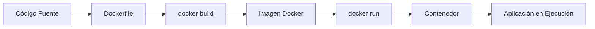
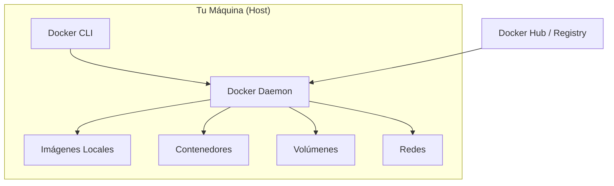

# 🐳 Conceptos Básicos y Primeros Pasos con Docker

Esta nota sirve como puerta de entrada a los fundamentos de Docker. Aquí encontrarás los conceptos esenciales y una ruta de aprendizaje ordenada para dominar los comandos y operaciones básicas.

---

## 📋 ¿Qué es Docker?

Docker es una plataforma de **contenedores** que permite empaquetar, distribuir y ejecutar aplicaciones de forma aislada y reproducible. Un contenedor es como una "caja ligera" que incluye todo lo necesario para que una aplicación funcione: código, runtime, herramientas del sistema, librerías y configuraciones.

> [!info] Diferencia clave
> Una **imagen** es el plano/plantilla (inmutable). Un **contenedor** es la instancia en ejecución de esa imagen.

---

## 🗺️ Ruta de Aprendizaje Recomendada

Sigue este orden para construir tu conocimiento desde cero:

| Orden | Nota                                             | Qué Aprenderás                                             |
| :---- | :----------------------------------------------- | :--------------------------------------------------------- |
| 1     | [[02_descarga_imagenes_y_creacion_contenedores]] | Descargar imágenes y crear tu primer contenedor            |
| 2     | [[03_gestion_de_contenedores_ps_commit]]         | Listar, inspeccionar y gestionar el estado de contenedores |
| 3     | [[04_inspeccion_logs_y_attach]]                  | Leer logs y conectarte a contenedores en ejecución         |
| 4     | [[05_mantenimiento_prune_y_etiquetas]]           | Limpiar recursos y etiquetar contenedores                  |
| 5     | [[06_gestion_de_imagenes]]                       | Gestionar imágenes: listar, etiquetar, guardar y eliminar  |
| 6     | [[07_variables_de_entorno_e_inicializacion]]     | Configurar variables de entorno al iniciar contenedores    |
| 7     | [[08_ciclo_de_vida_sencillo]]                    | Entender el ciclo de vida completo de un contenedor        |
| 8     | [[09_inicializar_imagen_con_run]]                | Dominar `docker run` y todas sus opciones                  |
| 9     | [[10_ejemplo_servidor_web_basico]]               | Caso práctico: servidor web con contenedor activo          |
| 10    | [[11_eliminacion_y_recarga_en_caliente]]         | Eliminar imágenes y recargar contenedores sin perder datos |

---

## 🏗️ Arquitectura Básica de Docker

- **Docker CLI**: La terminal desde la que escribes comandos (`docker run`, `docker ps`...).
- **Docker Daemon**: El servicio en segundo plano que gestiona imágenes, contenedores, redes y volúmenes.
- **Docker Hub**: El registro público de imágenes oficiales y comunitarias.

> [!tip] Consejo de principiante
> No intentes memorizar todos los comandos. Ten a mano la [[01_chuleta_general_de_comandos_docker|chuleta de comandos]] y practica cada concepto con ejemplos reales.

---

## 🔗 Notas Relacionadas

- [[02_descarga_imagenes_y_creacion_contenedores]] — Tu primera imagen y contenedor
- [[08_ciclo_de_vida_sencillo]] — El ciclo de vida de un contenedor explicado paso a paso
- [[MOC_Fundamentos]] — Índice general de la categoría Fundamentos
- [[MOC_Docker_General]] — Índice central de todo el Vault
