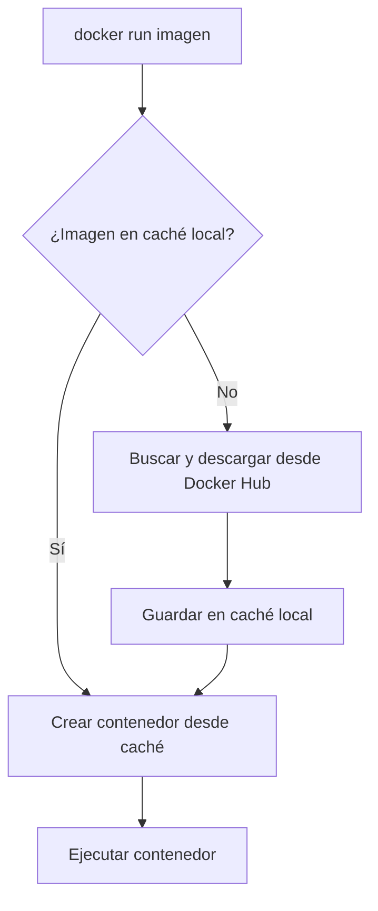

# 📥 Descarga de Imágenes y Creación de Contenedores

Aprenderás a buscar imágenes en Docker Hub, descargarlas a tu máquina local y crear tus primeros contenedores.

---

## 🔍 Docker Hub: El Registro Público de Imágenes

Docker Hub ([hub.docker.com](https://hub.docker.com/)) es el repositorio oficial donde se almacenan y distribuyen imágenes de contenedores. Contiene imágenes oficiales (mantenidas por Docker) y miles de imágenes comunitarias.

Al ejecutar `docker run`, Docker sigue este orden:



> [!tip] Imagen más minimalista
> `hello-world` es la imagen más pequeña y simple que existe. Perfecta para verificar que Docker funciona correctamente.

---

## 🚀 Tu Primer Contenedor: `docker run hello-world`

```bash
docker run hello-world
```

Este comando:

1. Busca la imagen `hello-world` en tu máquina local
2. Si no la encuentra, la descarga de Docker Hub
3. Crea un contenedor nuevo a partir de la imagen
4. Ejecuta el comando por defecto de la imagen (que imprime un mensaje de bienvenida)
5. El contenedor se detiene al terminar

---

## 🔧 `docker run --rm -it node:22 --version`

Desglose de cada flag del comando:

| Parte        | Explicación                                                                                                                             |
| :----------- | :-------------------------------------------------------------------------------------------------------------------------------------- |
| `docker run` | Crea y arranca un nuevo contenedor                                                                                                      |
| `--rm`       | **Remove**: elimina automáticamente el contenedor al detenerse. Ideal para pruebas rápidas y evitar acumulación de contenedores parados |
| `-it`        | `-i` (interactive) + `-t` (tty): asigna una pseudo-terminal y mantiene STDIN abierta para interactuar con el proceso                    |
| `node:22`    | Imagen oficial de Node.js versión 22.x LTS. Docker la descargará si no existe en local                                                  |
| `--version`  | Argumento que se pasa al entrypoint. Se ejecuta como `node --version` dentro del contenedor                                             |

### Secuencia cronológica al pulsar Enter

1. **Verificación de caché**: Docker comprueba si tienes `node:22` en local
2. **Descarga** (si es necesario): Descarga la imagen desde Docker Hub (~cientos de MB)
3. **Creación efímera**: Crea un contenedor con la anotación de auto-eliminación (`--rm`)
4. **Conexión en vivo**: Tu terminal se engancha al proceso interno (`-it`)
5. **Ejecución**: Se lanza `node --version`
6. **Salida**: Verás `v22.x.x` en pantalla
7. **Finalización y limpieza**: El proceso termina y Docker borra el contenedor automáticamente

---

## 🐚 Shell Interactivo: `docker run --rm -it ubuntu bash`

| Parte    | Significado                                     |
| :------- | :---------------------------------------------- |
| `ubuntu` | Imagen oficial de Ubuntu (por defecto `latest`) |
| `bash`   | Comando a ejecutar: el shell interactivo Bash   |

Este comando te da una terminal Bash completa dentro de un contenedor Ubuntu. Al salir (`exit` o `Ctrl+D`), el contenedor se elimina gracias a `--rm`.

---

## 📋 Variantes Comunes de `docker run`

| Propósito                    | Comando                                                    |
| :--------------------------- | :--------------------------------------------------------- |
| Ejecutar en segundo plano    | `docker run -d imagen`                                     |
| Mapear puertos               | `docker run -p 8080:80 nginx`                              |
| Montar un volumen            | `docker run -v "$PWD":/app -w /app node:22 node script.js` |
| Poner nombre al contenedor   | `docker run --name mi-app nginx`                           |
| Ejecutar y eliminar al salir | `docker run --rm -it alpine sh`                            |

> [!warning] Sin `--rm`
> Si omites `--rm`, el contenedor permanece en estado `Exited` ocupando espacio en disco. Usa `docker ps -a` para verlo y `docker rm` para limpiarlo manualmente.

---

## 🔗 Enlaces Oficiales

🔗 [Documentación oficial de `docker run`](https://docs.docker.com/engine/reference/run/)
🔗 [Imagen oficial de Node en Docker Hub](https://hub.docker.com/_/node)
🔗 [Guía de inicio rápido de Docker](https://docs.docker.com/get-started/)
🔗 [Tags de Node.js 22.x en Docker Hub](https://hub.docker.com/_/node/tags?page=1&name=22)

---

## 🔗 Notas Relacionadas

- [[01_conceptos_y_primeros_pasos]] — Índice de conceptos básicos y ruta de aprendizaje
- [[03_gestion_de_contenedores_ps_commit]] — Cómo listar y gestionar contenedores tras ejecutarlos
- [[09_inicializar_imagen_con_run]] — Guía avanzada de `docker run` con todas las opciones
- [[MOC_Fundamentos]] — Índice general de la categoría Fundamentos
