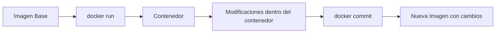

# 📊 Gestión de Contenedores: `docker ps`, `commit` e Inspección de Estado

Aprenderás a listar, inspeccionar y guardar el estado de tus contenedores. Estos comandos son el **termómetro** y el **historial médico** de todos tus contenedores.

---

## 🔍 `docker ps` — El "Ahora Mismo"

`docker ps` muestra **solo los contenedores que están ENCENDIDOS y funcionando en este instante**.

### Columnas de la salida

```
CONTAINER ID   IMAGE              COMMAND                  CREATED         STATUS         PORTS                    NAMES
a1b2c3d4e5f6   nginx:latest       "/docker-entrypoint.…"   5 minutes ago   Up 5 minutes   0.0.0.0:80->80/tcp       mi-web
f6e5d4c3b2a1   postgres:13        "docker-entrypoint.s…"   2 hours ago     Up 2 hours     5432/tcp                 db-postgres
```

| Columna          | Significado                                                                      |
| :--------------- | :------------------------------------------------------------------------------- |
| **CONTAINER ID** | Identificador único (12 caracteres). Lo usarás para `stop`, `logs`, `exec`, etc. |
| **IMAGE**        | Imagen base de la que partió el contenedor                                       |
| **COMMAND**      | Comando que se ejecuta dentro (el `CMD` o `ENTRYPOINT` del Dockerfile)           |
| **CREATED**      | Tiempo desde que se creó el contenedor                                           |
| **STATUS**       | **Dato clave**: `Up X minutes` significa que está funcionando                    |
| **PORTS**        | Puertos expuestos y redirigidos                                                  |
| **NAMES**        | Nombre asignado (o nombre aleatorio de Docker)                                   |

> [!warning] Contenedores detenidos
> Si un contenedor se detiene, **desaparece de `docker ps`**. Para verlo necesitas `docker ps -a`.

---

## 📜 `docker ps -a` — El "Historial Completo"

La opción `-a` (abreviatura de `--all`) muestra **TODOS los contenedores**: encendidos, apagados, en pausa o fallidos.

### Estados en STATUS

| Estado         | Significado                                                                     |
| :------------- | :------------------------------------------------------------------------------ |
| `Exited (0)`   | El contenedor terminó voluntariamente y sin errores                             |
| `Exited (1)`   | El contenedor **falló** (código de error). Algo salió mal dentro                |
| `Exited (137)` | El contenedor fue **matado a la fuerza** (SIGKILL: sin memoria o `docker kill`) |
| `Created`      | Se creó con `docker create` pero **nunca se ha arrancado**                      |
| `Paused`       | El contenedor está congelado (procesos en suspenso)                             |

---

## 🆚 Comparativa Rápida

| Comando        | Muestra          | Estados típicos                     | ¿Para qué sirve?                                           |
| :------------- | :--------------- | :---------------------------------- | :--------------------------------------------------------- |
| `docker ps`    | Solo **activos** | `Up X minutes`                      | Ver qué servicios están corriendo ahora                    |
| `docker ps -a` | **Todos**        | `Up`, `Exited`, `Created`, `Paused` | Ver contenedores acumulados, recuperar IDs, hacer limpieza |

---

## 🤔 ¿Por qué Docker guarda los contenedores detenidos?

Docker **no borra automáticamente** los contenedores detenidos por diseño:

1. **Puedes reactivarlos** con `docker start <id>` y retomar donde lo dejaste
2. **Los logs persisten** y puedes consultarlos con [[04_inspeccion_logs_y_attach|docker logs]]
3. **Puedes inspeccionar** su configuración con `docker inspect`
4. **Puedes crear una imagen** a partir del estado del contenedor con `docker commit`

---

## 💾 `docker commit` — Guardar el Estado de un Contenedor

`docker commit` crea una **nueva imagen** a partir de los cambios realizados en un contenedor.

```bash
# Guardar el estado actual de un contenedor como nueva imagen
docker commit <container-id> mi-nueva-imagen:v1
```



> [!tip] ¿Cuándo usar commit?
> Útil para experimentación rápida o debugging. Para entornos de producción, es mejor usar un [[01_dockerfile_mas_basico|Dockerfile]] que documente todos los cambios de forma reproducible.

### Flags útiles de `docker ps`

| Flag              | Descripción                      | Ejemplo                                 |
| :---------------- | :------------------------------- | :-------------------------------------- |
| `-a` / `--all`    | Mostrar todos los contenedores   | `docker ps -a`                          |
| `-q` / `--quiet`  | Solo IDs (útil para scripting)   | `docker ps -q`                          |
| `-l` / `--latest` | Solo el último contenedor creado | `docker ps -l`                          |
| `-n <N>`          | Los últimos N contenedores       | `docker ps -n 5`                        |
| `--filter`        | Filtrar por estado, nombre, etc. | `docker ps -a --filter "status=exited"` |
| `-s` / `--size`   | Mostrar tamaño en disco          | `docker ps -s`                          |

---

## 🔗 Notas Relacionadas

- [[02_descarga_imagenes_y_creacion_contenedores]] — Cómo crear tus primeros contenedores
- [[04_inspeccion_logs_y_attach]] — Cómo leer logs y conectarte a contenedores
- [[05_mantenimiento_prune_y_etiquetas]] — Cómo limpiar contenedores acumulados
- [[MOC_Fundamentos]] — Índice general de la categoría Fundamentos
