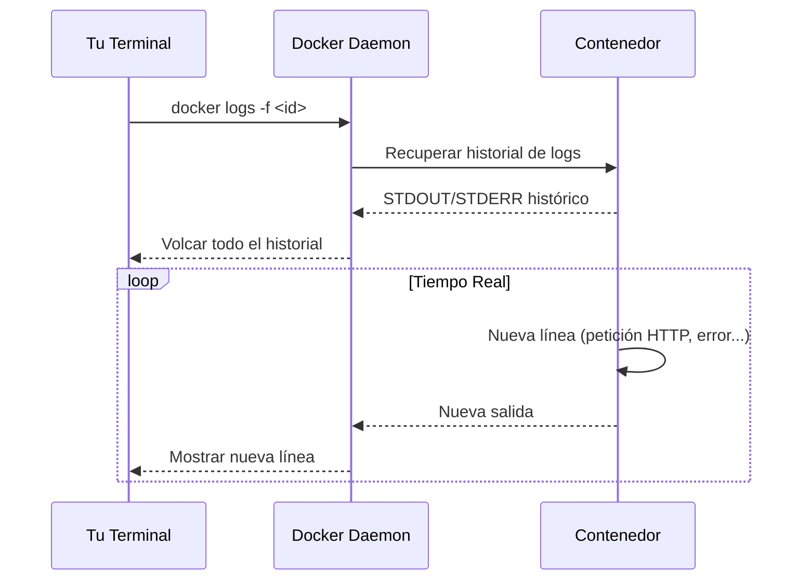

# 🔎 Inspección de Contenedores: `docker logs` y `docker attach`

Aprenderás a leer los registros (logs) de tus contenedores y a conectarte a ellos en tiempo real. Estas herramientas son esenciales para depurar errores y monitorear el comportamiento de tus aplicaciones.

---

## 📋 `docker logs` — El Historial de Salida

`docker logs <id>` muestra **todo lo que el proceso principal del contenedor ha escrito en STDOUT y STDERR** desde que se inició.

> [!info] ¿De dónde vienen los logs?
> Por defecto, Docker almacena los logs de cada contenedor en un archivo JSON en el sistema host. `docker logs` simplemente lee ese archivo.

---

## 🎛️ Opciones de `docker logs`

| Opción                | Descripción                                                     | Ejemplo                        |
| :-------------------- | :-------------------------------------------------------------- | :----------------------------- |
| `--tail` / `-n`       | Últimas N líneas                                                | `docker logs --tail 100 <id>`  |
| `--follow` / `-f`     | **Tiempo real**: sigue mostrando nuevas líneas (como `tail -f`) | `docker logs -f <id>`          |
| `--since`             | Logs desde una fecha/hora                                       | `docker logs --since 1h <id>`  |
| `--until`             | Logs anteriores a una fecha/hora                                | `docker logs --until 30m <id>` |
| `--timestamps` / `-t` | Añade marca de tiempo a cada línea                              | `docker logs -t <id>`          |

---

## 🔄 `docker logs -f` — Seguimiento en Tiempo Real

```bash
docker logs -f 09d9b8912d4b
```



| Parte             | Significado                                                              |
| :---------------- | :----------------------------------------------------------------------- |
| `docker logs`     | Comando para ver los registros generados por un contenedor               |
| `-f` (`--follow`) | Mantiene la terminal a la escucha y muestra nuevas líneas en tiempo real |
| `09d9b8912d4b`    | ID del contenedor (solo primeros 12 caracteres del hash completo)        |

Para salir del modo `-f`, pulsa `Ctrl + C`. El contenedor **sigue ejecutándose** sin problemas.

---

## 🔗 `docker attach` — Conectarse a un Contenedor en Ejecución

`docker attach` conecta tu terminal a la entrada/salida estándar de un contenedor **que ya está corriendo**.

```bash
docker attach <container-id>
```

> [!warning] Diferencia clave: `attach` vs `exec`
>
> - `docker attach` te conecta al **proceso principal** (PID 1). Si haces `Ctrl+C`, **matas el contenedor**.
> - `docker exec -it <id> bash` crea un **nuevo proceso** dentro del contenedor. `Ctrl+C` solo mata ese proceso nuevo.
>
> Para tareas de inspección, prefiere `docker exec`. Usa `attach` solo si necesitas interactuar directamente con el proceso principal.

---

## 🧪 Ejemplos Prácticos

### Depurar un contenedor que falla al arrancar

```bash
# 1. Listar todos los contenedores (incluidos los caídos)
docker ps -a

# 2. Ver las últimas 50 líneas del contenedor fallido
docker logs --tail 50 <id-contenedor-caido>

# 3. Ver logs con marcas de tiempo para correlacionar eventos
docker logs -t <id-contenedor-caido>
```

### Monitorear un servidor web en producción

```bash
# Ver logs en tiempo real de nginx
docker logs -f mi-nginx

# Ver solo logs de los últimos 10 minutos
docker logs --since 10m mi-nginx
```

---

## ⚠️ Consideraciones Importantes

- **Contenedor detenido**: Puedes ver los logs aunque el contenedor esté parado. Docker los conserva hasta que elimines el contenedor.
- **Driver de logging**: Si usas un driver externo (Syslog, Fluentd), `docker logs` podría no funcionar. Por defecto funciona con `json-file` y `journald`.
- **Logs a archivo**: Algunas apps escriben logs a `/var/log/` interno. Para que `docker logs` los vea, la app debe escribir a `STDOUT`/`STDERR`.

> [!tip] Buenas prácticas de logging
> Las imágenes oficiales (nginx, node, postgres) ya vienen configuradas para escribir a STDOUT/STDERR. Si creas tu propia imagen, asegúrate de que tu aplicación haga lo mismo.

---

## 🔗 Notas Relacionadas

- [[03_gestion_de_contenedores_ps_commit]] — Cómo listar e identificar los contenedores
- [[05_mantenimiento_prune_y_etiquetas]] — Cómo limpiar contenedores y logs acumulados
- [[08_ciclo_de_vida_sencillo]] — Entender el ciclo completo de un contenedor
- [[MOC_Fundamentos]] — Índice general de la categoría Fundamentos
