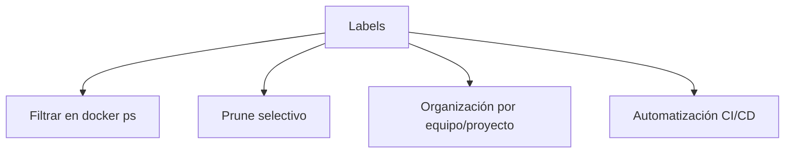
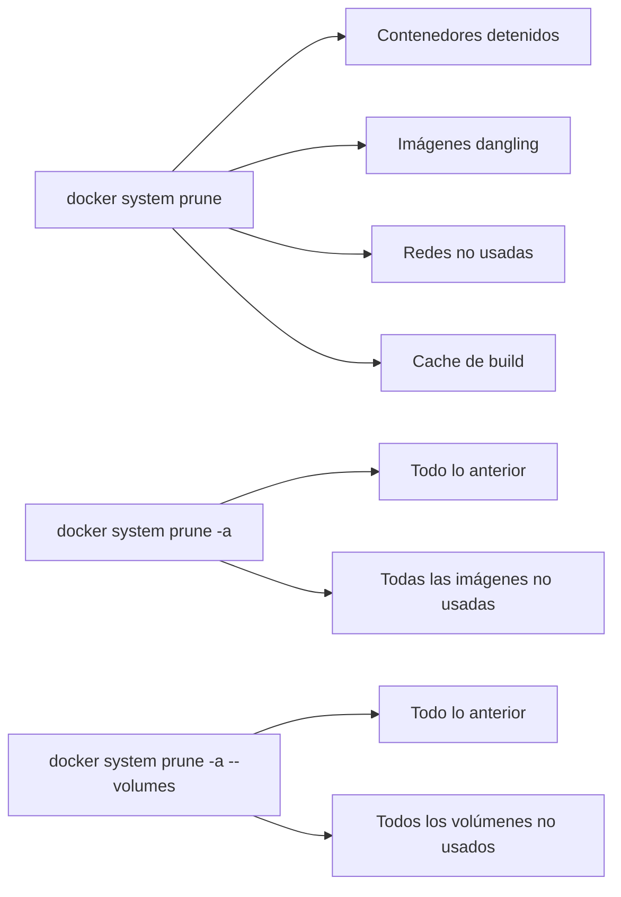

# 🧹 Mantenimiento de Docker: Prune, Labels y Limpieza Automatizada

Aprenderás a mantener limpio tu entorno Docker eliminando contenedores, imágenes, redes y volúmenes que ya no necesitas, así como a usar etiquetas (labels) para organizar tus recursos.

---

## 🗑️ `docker container prune` — Limpieza de Contenedores Detenidos

El comando **oficial y seguro** para eliminar todos los contenedores en estado `Exited`.

```bash
# Con confirmación (recomendado)
docker container prune

# Sin confirmación (para scripts)
docker container prune -f
```

---

## ⏱️ Prune con Filtros de Tiempo

Filtra por antigüedad para eliminar solo lo más viejo:

```bash
# Solo contenedores detenidos hace más de 24 horas
docker container prune --filter "until=24h"

# Solo contenedores detenidos hace más de 1 hora
docker container prune --filter "until=1h"
```

### Filtros disponibles para prune

| Filtro   | Ejemplo                      | Descripción                                    |
| :------- | :--------------------------- | :--------------------------------------------- |
| `until`  | `--filter "until=24h"`       | Recursos anteriores a la duración especificada |
| `label`  | `--filter "label=env=dev"`   | Solo recursos con una etiqueta específica      |
| `label!` | `--filter "label!=env=prod"` | Excluir recursos con una etiqueta              |

---

## 🔧 Método Clásico con Tuberías

La forma "artesanal" usada en scripts antiguos:

```bash
# Eliminar todos los contenedores detenidos
docker rm $(docker ps -a -q --filter "status=exited")
```

Desglose:

- `docker ps -a -q --filter "status=exited"` → devuelve **solo los IDs** de contenedores detenidos
- `docker rm $(...)` → elimina todos esos IDs

---

## 🤖 Automatización Programada

### Linux/Mac (cron)

```bash
# Editar crontab
crontab -e

# Borrar contenedores detenidos > 24h todas las noches a las 3 AM
0 3 * * * /usr/bin/docker container prune -f --filter "until=24h"
```

### Windows (Tarea Programada)

Crea una tarea programada que ejecute:

```powershell
docker container prune -f --filter "until=24h"
```

---

## 🏷️ Labels — Organizar Recursos con Etiquetas

Las labels permiten categorizar y filtrar contenedores, imágenes, volúmenes y redes.

```bash
# Crear contenedor con etiquetas
docker run -d --name mi-app \
  --label environment=production \
  --label team=backend \
  --label version=2.0 \
  nginx:latest

# Filtrar por etiqueta
docker ps --filter "label=environment=production"
docker ps --filter "label=team=backend"
```

### Ventajas de usar Labels



---

## 🧹 Limpieza Completa del Sistema

### Tabla de comandos de limpieza

| Comando                            | ¿Qué elimina?                                              |
| :--------------------------------- | :--------------------------------------------------------- |
| `docker container prune`           | Contenedores detenidos                                     |
| `docker image prune`               | Imágenes colgantes (dangling)                              |
| `docker image prune -a`            | **Todas** las imágenes no usadas por contenedores          |
| `docker network prune`             | Redes no usadas por ningún contenedor                      |
| `docker volume prune`              | Volúmenes no usados por ningún contenedor                  |
| `docker system prune`              | **Todo lo anterior junto** (contenedores, imágenes, redes) |
| `docker system prune -a --volumes` | Limpieza **total**: incluye todas las imágenes y volúmenes |

> [!warning] ¡Cuidado con `system prune -a`!
> `docker system prune -a` elimina **todas** las imágenes no asociadas a un contenedor en ejecución. Si tienes imágenes que quieres conservar aunque no estén corriendo, usa la versión sin `-a`.



---

## ⚠️ ¿Qué pasa con los Volúmenes?

`docker container prune` **NO elimina volúmenes** por defecto. Los volúmenes son datos persistentes y Docker prefiere no borrarlos. Para limpiarlo todo:

```bash
docker system prune -a --volumes
```

---

## 🔗 Notas Relacionadas

- [[03_gestion_de_contenedores_ps_commit]] — Listar e identificar contenedores antes de limpiarlos
- [[06_gestion_de_imagenes]] — Gestión completa del ciclo de vida de imágenes
- [[11_eliminacion_y_recarga_en_caliente]] — Estrategias avanzadas de eliminación y recarga
- [[MOC_Fundamentos]] — Índice general de la categoría Fundamentos
