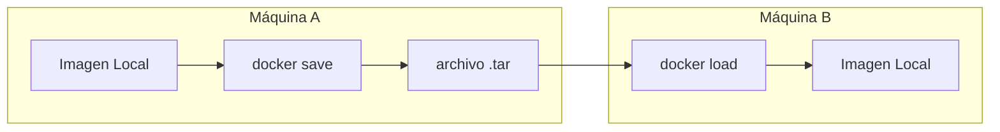

# 🖼️ Gestión de Imágenes Docker: Listar, Etiquetar, Guardar y Eliminar

Aprenderás a gestionar el ciclo de vida completo de las imágenes Docker: listarlas, inspeccionarlas, etiquetarlas, guardarlas, cargarlas y eliminarlas.

---

## 📋 `docker images` — Listar Imágenes Locales

Muestra todas las imágenes que has descargado (`pull`) o construido (`build`) localmente.

### Salida típica

```text
REPOSITORY          TAG                 IMAGE ID            CREATED             SIZE
hola-docker         latest              a1b2c3d4e5f6        2 hours ago         5.6MB
nginx               latest              605c77e624dd        2 weeks ago         142MB
alpine              3.11                e7d92cdc71fe        2 years ago         5.6MB
alpine              latest              e7d92cdc71fe        2 years ago         5.6MB
<none>              <none>              9g8h7i6j5k4l        3 days ago          1.2GB
```

### Anatomía de las columnas

| Columna        | Significado              | Detalle                                                            |
| :------------- | :----------------------- | :----------------------------------------------------------------- |
| **REPOSITORY** | Nombre de la imagen      | Nombre oficial (`nginx`) o personalizado (`tu-usuario/mi-app`)     |
| **TAG**        | Versión/etiqueta         | Por defecto `latest`. Una misma REPOSITORY puede tener varios TAGs |
| **IMAGE ID**   | DNI único (hash SHA-256) | 12 caracteres. Dos imágenes distintas nunca comparten ID           |
| **CREATED**    | Fecha de construcción    | Cuándo el autor original la compiló, no cuándo la descargaste      |
| **SIZE**       | Espacio en disco         | Peso real comprimido. Alpine ~5.6MB vs Ubuntu ~70MB                |

---

## ⚠️ Imágenes Colgantes (Dangling): `<none>:<none>`

```text
<none>              <none>              9g8h7i6j5k4l        3 days ago          1.2GB
```

Aparecen cuando:

- Construyes una imagen nueva con el mismo nombre (`-t`) que una existente. La vieja **pierde su nombre** pero sigue ocupando espacio.
- Haces `docker build` sin `-t`.

Para limpiarlas:

```bash
docker image prune   # Solo imágenes colgantes
```

---

## 🎛️ Flags Esenciales

| Flag                           | Descripción                                                    | Ejemplo                                             |
| :----------------------------- | :------------------------------------------------------------- | :-------------------------------------------------- |
| `-a` / `--all`                 | Todas las imágenes, incluidas las intermedias (capas de build) | `docker images -a`                                  |
| `-q` / `--quiet`               | Solo IMAGE IDs (útil para scripting)                           | `docker images -q`                                  |
| `--filter "dangling=true"`     | Solo imágenes colgantes                                        | `docker images --filter "dangling=true"`            |
| `--filter "reference=nginx:*"` | Filtrar por nombre y tag                                       | `docker images --filter "reference=nginx:*"`        |
| `--format`                     | Salida personalizada con Go templates                          | `docker images --format "{{.Repository}}:{{.Tag}}"` |

### Limpieza masiva con `-q`

```bash
# Borrar TODAS las imágenes (¡cuidado!)
docker rmi $(docker images -q)
```

> [!warning] Peligro con `rmi` masivo
> `docker rmi $(docker images -q)` borra **todas** las imágenes. Si tienes contenedores basados en ellas, docker rechazará el borrado. Usa `-f` para forzar.

---

## 🏷️ `docker tag` — Etiquetar Imágenes

Asigna un nombre y tag descriptivo a una imagen:

```bash
# Etiquetar una imagen local
docker tag <image-id> mi-usuario/mi-app:v1.0

# Crear alias: latest también apunta a v1.0
docker tag mi-usuario/mi-app:v1.0 mi-usuario/mi-app:latest
```

---

## 💾 `docker save` y `docker load` — Exportar e Importar

### Guardar una imagen como archivo .tar

```bash
# Guardar una imagen a un archivo
docker save -o mi-app.tar mi-usuario/mi-app:v1.0

# Guardar múltiples imágenes
docker save -o mis-imagenes.tar imagen1:v1 imagen2:v1
```

### Cargar una imagen desde un archivo .tar

```bash
docker load -i mi-app.tar
```

> [!tip] ¿Cuándo usar save/load?
>
> - Transferir imágenes entre máquinas sin pasar por un registry (air-gapped environments)
> - Backup de imágenes personalizadas
> - Distribución offline en entornos sin internet



---

## 🗑️ `docker rmi` — Eliminar Imágenes

```bash
# Por ID
docker rmi a1b2c3d4e5f6

# Por nombre:tag
docker rmi nginx:latest

# Forzar eliminación aunque haya contenedores usándola
docker rmi -f a1b2c3d4e5f6

# Eliminar todas las imágenes no usadas
docker image prune -a
```

---

## 🔗 Notas Relacionadas

- [[05_mantenimiento_prune_y_etiquetas]] — Limpieza programada y uso de labels
- [[02_descarga_imagenes_y_creacion_contenedores]] — Cómo descargar imágenes de Docker Hub
- [[11_eliminacion_y_recarga_en_caliente]] — Estrategias avanzadas de eliminación
- [[MOC_Fundamentos]] — Índice general de la categoría Fundamentos
