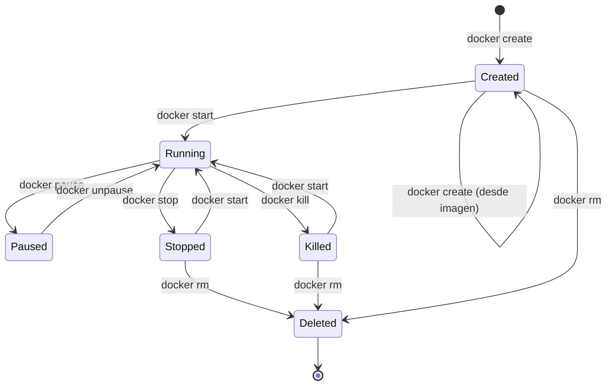
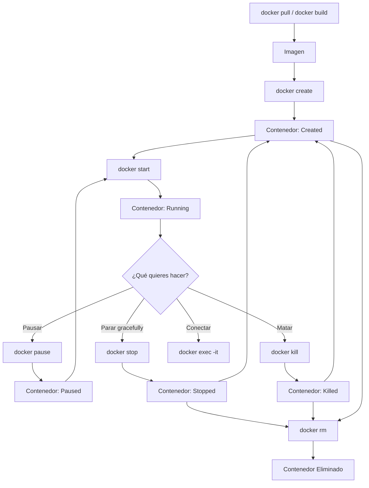

# 🔄 Ciclo de Vida Sencillo de un Contenedor Docker

Comprenderás todas las etapas por las que pasa un contenedor Docker, desde su creación hasta su eliminación, y los comandos asociados a cada fase.

---

## 🗺️ El Viaje Completo



---

## 📋 Estados del Contenedor

| Estado      | Comando que lo produce        | Significado                                                    |
| :---------- | :---------------------------- | :------------------------------------------------------------- |
| **Created** | `docker create`               | El contenedor existe pero nunca se ha arrancado                |
| **Running** | `docker start` / `docker run` | El proceso principal (PID 1) está ejecutándose                 |
| **Paused**  | `docker pause`                | Procesos congelados (SIGSTOP). Se reanuda con `docker unpause` |
| **Stopped** | `docker stop`                 | Parada graceful (SIGTERM → SIGKILL tras timeout)               |
| **Killed**  | `docker kill`                 | Parada forzosa inmediata (SIGKILL)                             |
| **Deleted** | `docker rm`                   | El contenedor se elimina del sistema                           |

---

## 🔍 Comandos por Fase del Ciclo

### 1. Creación

```bash
# Crear un contenedor sin arrancarlo
docker create --name mi-contenedor nginx:latest

# Crear y arrancar en un solo paso
docker run -d --name mi-contenedor nginx:latest
```

### 2. Arranque

```bash
# Arrancar un contenedor existente
docker start mi-contenedor

# Arrancar y conectarse a la salida
docker start -a mi-contenedor

# Arrancar en modo interactivo
docker start -ai mi-contenedor
```

### 3. Pausa / Reanudación

```bash
# Congelar procesos
docker pause mi-contenedor

# Reanudar
docker unpause mi-contenedor
```

### 4. Parada

```bash
# Parada graceful (SIGTERM, espera 10s, luego SIGKILL)
docker stop mi-contenedor

# Parada con timeout personalizado (30 segundos)
docker stop -t 30 mi-contenedor

# Parada forzosa inmediata (SIGKILL)
docker kill mi-contenedor
```

> [!tip] `stop` vs `kill`
>
> - `docker stop`: envía SIGTERM (la app puede limpiar recursos) → espera timeout → SIGKILL
> - `docker kill`: envía SIGKILL directamente (la app no tiene oportunidad de reaccionar)
>
> Usa `stop` siempre que puedas. Reserva `kill` para procesos bloqueados.

### 5. Reinicio

```bash
# Reiniciar un contenedor (stop + start)
docker restart mi-contenedor

# Reiniciar con timeout personalizado
docker restart -t 5 mi-contenedor
```

### 6. Eliminación

```bash
# Eliminar un contenedor detenido
docker rm mi-contenedor

# Eliminar un contenedor en ejecución (lo para primero)
docker rm -f mi-contenedor

# Eliminar automáticamente al detenerse
docker run --rm nginx:latest
```

---

## 🔄 Políticas de Reinicio (`--restart`)

Controla qué hace Docker si el contenedor se detiene:

| Política         | Comportamiento                                                     |
| :--------------- | :----------------------------------------------------------------- |
| `no` (default)   | No reiniciar nunca automáticamente                                 |
| `on-failure`     | Reiniciar solo si el contenedor falla (exit code ≠ 0)              |
| `on-failure:5`   | Reiniciar en fallo, máximo 5 intentos                              |
| `always`         | Reiniciar siempre que se detenga, incluso tras reinicio del daemon |
| `unless-stopped` | Como `always`, pero no reinicia si lo paraste manualmente          |

```bash
# Reiniciar siempre (útil para servidores en producción)
docker run -d --restart always --name mi-servidor nginx

# Reiniciar en fallo, máximo 3 intentos
docker run -d --restart on-failure:3 --name mi-app node:22
```

---

## 📊 Flujo de Comandos



---

## 🔗 Notas Relacionadas

- [[01_conceptos_y_primeros_pasos]] — Conceptos básicos y ruta de aprendizaje
- [[09_inicializar_imagen_con_run]] — Guía avanzada de `docker run` con todas las opciones
- [[07_ciclo_de_vida_en_imagenes_optimizadas]] — Ciclo de vida en imágenes multi-stage optimizadas
- [[09_ciclo_de_vida_multistage]] — Ciclo de vida específico para multi-stage builds
- [[MOC_Fundamentos]] — Índice general de la categoría Fundamentos
