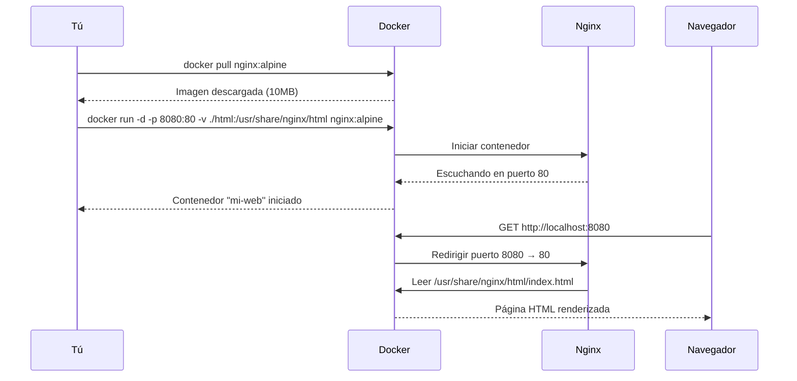

# 🌐 Ejemplo Práctico: Servidor Web Básico con Contenedor Activo

Caso práctico completo para desplegar un servidor web con Docker, desde la descarga de la imagen hasta tener tu sitio sirviendo tráfico real.

---

## 🎯 Objetivo

Desplegar un servidor **Nginx** que sirva una página HTML personalizada, accesible desde `http://localhost:8080`.

---

## 🏗️ Arquitectura del Ejercicio


---

## 📁 Estructura de Archivos

```text
proyecto-web/
├── html/
│   └── index.html
└── README.md
```

---

## 🚀 Paso a Paso

### Paso 1: Crear la estructura de archivos

```bash
mkdir proyecto-web
cd proyecto-web
mkdir html
```

### Paso 2: Crear tu página HTML

Crea `html/index.html`:

```html
<!DOCTYPE html>
<html lang="es">
  <head>
    <meta charset="UTF-8" />
    <meta name="viewport" content="width=device-width, initial-scale=1.0" />
    <title>Mi Web en Docker</title>
    <style>
      body {
        font-family: system-ui, sans-serif;
        display: flex;
        justify-content: center;
        align-items: center;
        min-height: 100vh;
        margin: 0;
        background: #0f172a;
        color: #e2e8f0;
      }
      .container {
        text-align: center;
        padding: 2rem;
      }
      h1 {
        color: #38bdf8;
      }
      .badge {
        display: inline-block;
        background: #1e293b;
        padding: 0.5rem 1rem;
        border-radius: 0.5rem;
        margin-top: 1rem;
      }
    </style>
  </head>
  <body>
    <div class="container">
      <h1>🐳 ¡Hola desde Docker!</h1>
      <p>Esta página está siendo servida por Nginx dentro de un contenedor.</p>
      <div class="badge">nginx:alpine</div>
    </div>
  </body>
</html>
```

### Paso 3: Descargar la imagen de Nginx

```bash
docker pull nginx:alpine
```

> [!tip] ¿Por qué Alpine?
> La versión `nginx:alpine` pesa ~10MB vs ~140MB de `nginx:latest`. Ideal para entornos de desarrollo y producción ligera.

### Paso 4: Ejecutar el contenedor

```bash
docker run -d \
  --name mi-web \
  -p 8080:80 \
  -v "${PWD}/html:/usr/share/nginx/html:ro" \
  nginx:alpine
```

Desglose del comando:

| Flag                                        | Explicación                                                                                       |
| :------------------------------------------ | :------------------------------------------------------------------------------------------------ |
| `-d`                                        | Ejecuta en segundo plano (detached)                                                               |
| `--name mi-web`                             | Asigna un nombre fácil de recordar                                                                |
| `-p 8080:80`                                | Mapea el puerto 8080 de tu máquina al 80 del contenedor                                           |
| `-v "${PWD}/html:/usr/share/nginx/html:ro"` | Monta tu carpeta `html` en el directorio que Nginx usa para servir archivos. `:ro` = solo lectura |
| `nginx:alpine`                              | Imagen a usar                                                                                     |

### Paso 5: Verificar que funciona

```bash
# Ver que está corriendo
docker ps

# Ver logs en tiempo real
docker logs -f mi-web

# Probar con curl
curl http://localhost:8080
```

Abre `http://localhost:8080` en tu navegador. ¡Deberías ver tu página!

---

## 🔧 Gestión del Contenedor

```bash
# Ver logs
docker logs mi-web

# Detener
docker stop mi-web

# Reiniciar
docker start mi-web

# Entrar al contenedor para inspeccionar
docker exec -it mi-web sh

# Ver configuración de Nginx dentro del contenedor
docker exec mi-web nginx -T
```

---

## 🧹 Limpieza

```bash
# Detener y eliminar el contenedor
docker rm -f mi-web

# La imagen se queda en caché para futuros usos
docker images nginx:alpine

# Si quieres borrarla también
docker rmi nginx:alpine
```

---

## 📊 Flujo Completo del Ejercicio



---

## 🔗 Notas Relacionadas

- [[02_descarga_imagenes_y_creacion_contenedores]] — Fundamentos de `docker run` y descarga de imágenes
- [[09_inicializar_imagen_con_run]] — Todas las opciones avanzadas de `docker run`
- [[08_ciclo_de_vida_sencillo]] — El ciclo de vida del contenedor
- [[MOC_Fundamentos]] — Índice general de la categoría Fundamentos
