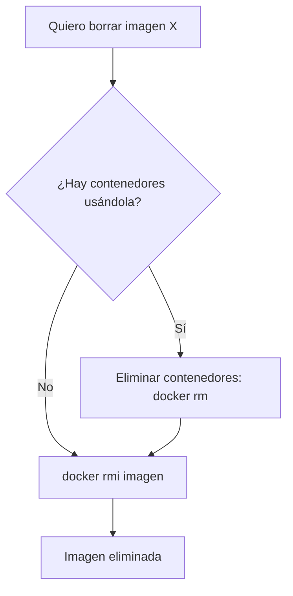

# 🔥 Eliminación de Imágenes y Recarga en Caliente de Contenedores

Aprenderás a eliminar imágenes de forma segura y a implementar recarga en caliente (hot reload) para desarrollo ágil con Docker.

---

## 🗑️ Eliminación Segura de Imágenes

### `docker rmi` — Eliminar una Imagen

```bash
# Por ID
docker rmi a1b2c3d4e5f6

# Por nombre:tag
docker rmi nginx:latest

# Forzar (aunque haya contenedores basados en ella)
docker rmi -f a1b2c3d4e5f6

# Eliminar múltiples imágenes a la vez
docker rmi imagen1:v1 imagen2:v1 imagen3:latest
```

> [!warning] No puedes borrar una imagen usada por un contenedor
> Si hay contenedores (incluso detenidos) basados en una imagen, `docker rmi` fallará. Usa `-f` solo si estás seguro, o primero elimina los contenedores.

### Flujo seguro de eliminación



---

## 🔄 Recarga en Caliente (Hot Reload) para Desarrollo

La recarga en caliente permite que los cambios en tu código fuente se reflejen **instantáneamente** dentro del contenedor sin reconstruir la imagen.

### Estrategia con Bind Mounts

```bash
docker run -d \
  --name dev-server \
  -p 3000:3000 \
  -v "${PWD}/src:/app/src" \
  -v "${PWD}/package.json:/app/package.json" \
  node:22-alpine \
  sh -c "npm install && npm run dev"
```

> [!tip] Cómo funciona
> Los bind mounts (`-v`) crean un espejo en tiempo real entre tu carpeta local y la del contenedor. Cuando guardas un archivo en tu editor, el cambio se refleja dentro del contenedor al instante.

### Ejemplo con Node.js + Nodemon

```bash
# package.json
{
  "scripts": {
    "dev": "nodemon --legacy-watch src/server.js"
  }
}
```

```bash
docker run -d \
  --name node-dev \
  -p 3000:3000 \
  -v "${PWD}:/app" \
  -w /app \
  node:22-alpine \
  sh -c "npm install && npm run dev"
```

---

## 🗑️ Eliminación con Recarga — El Flujo Completo

Cuando iteramos rápido en desarrollo, necesitamos un flujo ágil de "eliminar y recargar":

```bash
# 1. Detener y eliminar contenedor actual
docker rm -f mi-app

# 2. Reconstruir imagen (si cambió el Dockerfile)
docker build -t mi-app:dev .

# 3. Lanzar nueva versión
docker run -d --name mi-app -p 3000:3000 -v "${PWD}/src:/app/src" mi-app:dev
```

### Script automatizado

```bash
#!/bin/bash
# reload.sh — Eliminar, reconstruir y relanzar

CONTAINER_NAME="mi-app"
IMAGE_NAME="mi-app:dev"

echo "🧹 Eliminando contenedor anterior..."
docker rm -f $CONTAINER_NAME 2>/dev/null

echo "🔨 Reconstruyendo imagen..."
docker build -t $IMAGE_NAME .

echo "🚀 Lanzando nuevo contenedor..."
docker run -d \
  --name $CONTAINER_NAME \
  -p 3000:3000 \
  -v "${PWD}/src:/app/src" \
  $IMAGE_NAME

echo "✅ Listo. Ejecutando en http://localhost:3000"
docker logs -f $CONTAINER_NAME
```

---

## 📊 Comparativa de Estrategias

| Estrategia                  | Velocidad          | ¿Reconstruye imagen? | ¿Refleja cambios al instante? | Ideal para                      |
| :-------------------------- | :----------------- | :------------------- | :---------------------------- | :------------------------------ |
| **Bind mount + hot reload** | ⚡ Instantáneo     | ❌ No                | ✅ Sí                         | Desarrollo local                |
| **Reconstruir imagen**      | 🐢 Lento (minutos) | ✅ Sí                | ❌ No                         | Probar cambios en Dockerfile    |
| **docker cp**               | 🐢 Manual          | ❌ No                | ❌ No                         | Cambios puntuales en contenedor |
| **Usar --rm y recrear**     | ⚡ Rápido          | ❌ No                | ❌ No (necesitas re-lanzar)   | Pruebas rápidas                 |

---

## 🔗 Notas Relacionadas

- [[06_gestion_de_imagenes]] — Listar, etiquetar, guardar y eliminar imágenes
- [[05_mantenimiento_prune_y_etiquetas]] — Limpieza automatizada con prune
- [[08_ciclo_de_vida_sencillo]] — El ciclo de vida completo del contenedor
- [[MOC_Fundamentos]] — Índice general de la categoría Fundamentos
