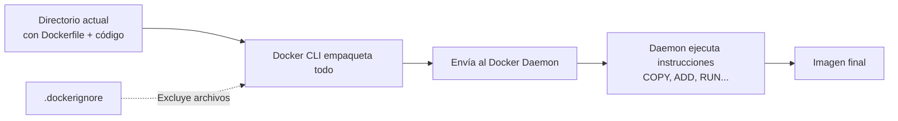

# 📄 El Dockerfile Más Básico: `docker build` Explicado

Aprenderás la anatomía del comando `docker build`, qué es el contexto de construcción y cómo etiquetar correctamente tus imágenes.

---

## 🔨 `docker build -t mi-primera-imagen .`

Este comando crea una imagen a partir de un `Dockerfile` y le asigna un nombre (tag).

### Desglose del comando

| Parte                  | Significado                                  | Importancia                                                      |
| :--------------------- | :------------------------------------------- | :--------------------------------------------------------------- |
| `docker build`         | Comando principal para construir imágenes    | Inicia el proceso de creación de la imagen                       |
| `-t mi-primera-imagen` | `-t` (tag) asigna un nombre a la imagen      | Permite referenciar la imagen por nombre en vez de por ID (hash) |
| `.`                    | Contexto de construcción (directorio actual) | Define los archivos que Docker puede usar durante el build       |

---

## 📦 ¿Qué es el Contexto de Construcción?

El **contexto de construcción** es el conjunto de archivos y directorios que Docker pone a disposición durante el build. Al usar `.`, se incluyen **todos los archivos del directorio actual**.



> [!warning] ¡Cuidado con el contexto!
> El contexto se envía **completo** al daemon. Si tu directorio tiene `node_modules`, logs o archivos grandes, la construcción será lenta. Usa siempre un archivo **`.dockerignore`** (ver [[04_uso_del_archivo_dockerignore]]).

---

## 🏷️ Estructura Completa de un Tag

```
[HOST[:PUERTO]/]RUTA[:ETIQUETA]
```

| Componente | Descripción                                       | Ejemplo             |
| :--------- | :------------------------------------------------ | :------------------ |
| `HOST`     | Registro donde se aloja (por defecto `docker.io`) | `docker.io`         |
| `RUTA`     | Namespace y repositorio                           | `mi-usuario/mi-app` |
| `ETIQUETA` | Versión (por defecto `latest`)                    | `v1.0`, `latest`    |

`mi-primera-imagen` → Docker lo interpreta como `docker.io/library/mi-primera-imagen:latest`

> [!tip] Buenas prácticas de versionado
>
> - Siempre especifica una etiqueta explícita: `mi-app:v1.2.3`
> - No uses `latest` en producción (es ambiguo)
> - Usa versionado semántico para releases

---

## 🔗 Enlaces Oficiales

🔗 [Documentación de `docker build`](https://docs.docker.com/reference/cli/docker/image/build/)
🔗 [Guía de buenas prácticas para Dockerfile](https://docs.docker.com/develop/develop-images/dockerfile_best-practices/)
🔗 [Referencia del Dockerfile](https://docs.docker.com/reference/dockerfile/)

---

## 🔗 Notas Relacionadas

- [[02_primer_dockerfile_paso_a_paso]] — Crea tu primer Dockerfile funcional con Alpine
- [[03_gestion_de_capas_dockerfile]] — Entiende el sistema de capas y la caché
- [[04_uso_del_archivo_dockerignore]] — Optimiza el contexto con `.dockerignore`
- [[MOC_Dockerfiles]] — Índice general de la categoría Dockerfiles
