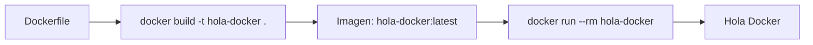

# 🐣 Tu Primer Dockerfile Paso a Paso: De Alpine a una Imagen Funcional

Crearás tu primer Dockerfile funcional, entenderás las instrucciones `FROM` y `CMD`, y ejecutarás tu primer contenedor desde una imagen propia.

---

## 📝 El Dockerfile Minimalista

```dockerfile
FROM alpine:3.11
CMD ["echo", "Hola Docker"]
```

---

## 🔍 Análisis Línea por Línea

### `FROM alpine:3.11`

- **¿Qué hace?** Establece Alpine Linux 3.11 como la imagen base.
- **¿Por qué Alpine?** Es una de las imágenes más ligeras (~5.6 MB), ideal para aprender y para producción ligera.
- **¿Por qué `:3.11`?** Especificar una versión concreta garantiza **reproducibilidad**. Si usas `latest`, el comportamiento puede cambiar con el tiempo.

> [!warning] Múltiples `FROM` sin `AS`
> Si pones varios `FROM` sin la cláusula `AS nombre`, Docker procesa todos pero solo el último define la imagen final. Los anteriores quedan como capas huérfanas ocupando caché. Si quieres multi-stage, usa `FROM imagen AS etapa`.

### `CMD ["echo", "Hola Docker"]`

- **¿Qué hace?** Define el comando por defecto que se ejecuta al iniciar un contenedor desde esta imagen.
- **Formato exec (JSON)**: `["echo", "Hola Docker"]` — ejecuta el binario `echo` directamente. Más seguro y eficiente porque `echo` se convierte en PID 1.
- **Formato shell** (alternativa): `CMD echo Hola Docker` — Docker llama a `/bin/sh -c "echo Hola Docker"`. El shell es PID 1, no el comando.

| Formato                              | PID 1                   | Rendimiento       | Seguridad                             |
| :----------------------------------- | :---------------------- | :---------------- | :------------------------------------ |
| Exec `["cmd", "arg"]`                | El comando directamente | ✅ Mejor          | ✅ Más seguro                         |
| Shell `cmd arg`                      | `/bin/sh -c`            | ❌ Una capa extra | ❌ El shell puede interpretar señales |
| Entrypoint `["cmd"]` + CMD `["arg"]` | El entrypoint con args  | ✅ Mejor          | ✅ Máximo control                     |

---

## 🚀 Construir y Ejecutar

### 1. Construir la imagen

```bash
# Con tag simple
docker build -t hola-docker .

# Con versión específica
docker build -t hola-docker:1.0 .

# Sin tag (necesitarás usar el ID)
docker build .
# Éxito: sha256: a1b2c3d4e5f6...
```



### 2. Ejecutar el contenedor

```bash
# Ejecutar y eliminar al terminar
docker run --rm hola-docker
# Salida: Hola Docker
```

### 3. Verificar que la imagen existe

```bash
docker images hola-docker
```

---

## 🧪 Experimentos

### Probar con diferentes versiones

```bash
# Construir versiones
docker build -t hola-docker:1.0 .
docker build -t hola-docker:dev .
docker build -t hola-docker:v2 .

# Listar todas las versiones
docker images hola-docker
```

### Usar otra imagen base

```dockerfile
FROM ubuntu:22.04
CMD ["echo", "Hola desde Ubuntu"]
```

---

## 🔗 Notas Relacionadas

- [[01_dockerfile_mas_basico]] — Anatomía de `docker build` y el contexto de construcción
- [[03_gestion_de_capas_dockerfile]] — El sistema de capas y cómo optimizar la caché
- [[05_optimizacion_y_peso_ligero]] — Estrategias para imágenes ligeras y eficientes
- [[MOC_Dockerfiles]] — Índice general de la categoría Dockerfiles
