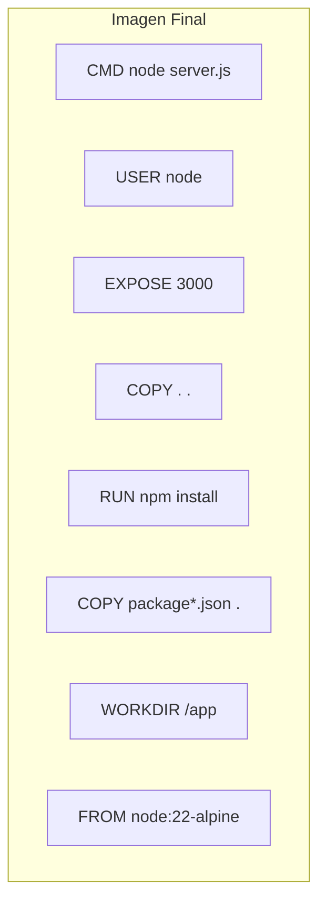
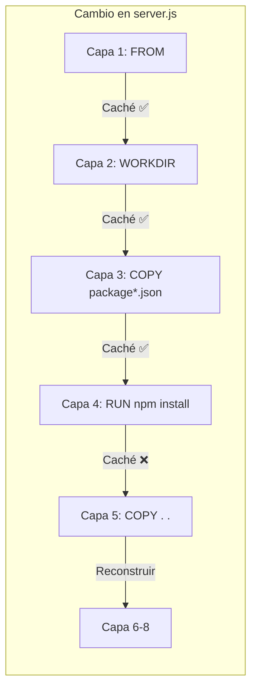

# 🧅 Gestión de Capas en el Dockerfile: Caché y Orden de Instrucciones

Entenderás el sistema de capas (layers) de Docker, cómo funciona la caché y por qué el orden de las instrucciones en tu Dockerfile es crítico para la velocidad de build.

---

## 🧱 ¿Qué son las Capas?

Cada instrucción en un Dockerfile (`FROM`, `COPY`, `RUN`, `CMD`) crea una **capa inmutable**. Estas capas se apilan para formar la imagen final.

> [!info] Analogía de la lasaña
> Cada capa (pasta, carne, bechamel, queso) se añade secuencialmente. Si cambias una capa intermedia (la carne), **todas las capas superiores deben rehacerse**.



---

## 🔄 Principio Fundamental de la Caché

- Si una capa **no ha cambiado**, Docker la **reutiliza** de la caché.
- Si una capa **cambia**, Docker **invalida** esa capa y **todas las posteriores**.

**Regla de oro**: Ordena las instrucciones de **menos a más cambiantes**. Las dependencias (`package.json`) cambian poco → van primero. El código fuente cambia mucho → va al final.

---

## ❌ Dockerfile Malo (Ineficiente)

```dockerfile
FROM node:22-alpine          # Capa 1
WORKDIR /app                 # Capa 2
COPY . .                     # Capa 3 ← ¡COPIA TODO PRIMERO!
RUN npm install              # Capa 4
EXPOSE 3000                  # Capa 5
USER node                    # Capa 6
CMD ["node", "server.js"]    # Capa 7
```

**Problema**: Cada vez que cambias **cualquier archivo** del código, la capa 3 (`COPY . .`) se invalida, forzando la reconstrucción de todas las capas 4-7, incluyendo `npm install` (que no necesitaba re-ejecutarse).

---

## ✅ Dockerfile Bueno (Óptimo)

```dockerfile
FROM node:22-alpine          # Capa 1
WORKDIR /app                 # Capa 2
COPY package*.json .         # Capa 3 ← Solo dependencias (cambian poco)
RUN npm install              # Capa 4 ← Solo se re-ejecuta si package.json cambia
COPY . .                     # Capa 5 ← Código fuente (cambia mucho, capa ligera)
EXPOSE 3000                  # Capa 6
USER node                    # Capa 7
CMD ["node", "server.js"]    # Capa 8
```

**Ventaja**: Al cambiar solo código fuente, Docker reutiliza las capas 1-4 de la caché (incluyendo `npm install`). Solo reconstruye de la capa 5 en adelante.



---

## 📊 Comparativa de Escenarios

| Escenario                                | Capas reutilizadas | Capas reconstruidas | Tiempo estimado       |
| :--------------------------------------- | :----------------- | :------------------ | :-------------------- |
| Cambio en `server.js` (Dockerfile bueno) | 1-4                | 5-8                 | ⚡ ~2s                |
| Cambio en `server.js` (Dockerfile malo)  | 1-2                | 3-7                 | 🐢 ~30s+              |
| Cambio en `package.json` (cualquiera)    | 1-2                | 3-8                 | 🐢 ~30s+ (inevitable) |

---

## 📐 Reglas para un Dockerfile Óptimo

1. **`FROM` primero** — la base inmutable.
2. **`WORKDIR`** — establecer directorio de trabajo.
3. **Archivos de dependencias** (`package.json`, `requirements.txt`) — cambian poco.
4. **`RUN` de instalación** (`npm install`, `pip install`) — solo si las dependencias cambian.
5. **Código fuente** (`COPY . .`) — cambia con frecuencia.
6. **Metadatos** (`EXPOSE`, `USER`, `LABEL`) — muy ligeros.
7. **`CMD` / `ENTRYPOINT`** — al final.

> [!tip] Tip extra
> Combina comandos `RUN` relacionados con `&&` para reducir capas:
>
> ```dockerfile
> RUN apt-get update && apt-get install -y curl && rm -rf /var/lib/apt/lists/*
> ```

---

## 🔗 Notas Relacionadas

- [[02_primer_dockerfile_paso_a_paso]] — Tu primer Dockerfile funcional
- [[05_optimizacion_y_peso_ligero]] — Estrategias avanzadas de optimización
- [[08_busqueda_y_multistage_build]] — Multi-stage builds para producción
- [[MOC_Dockerfiles]] — Índice general de la categoría Dockerfiles
