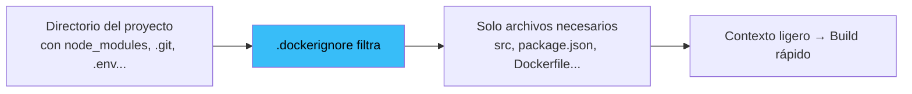

# 🙈 Uso del Archivo `.dockerignore`: Limpia y Protege tus Builds

Aprenderás a usar `.dockerignore` para acelerar tus builds, reducir el tamaño de las imágenes y evitar incluir accidentalmente secretos o archivos innecesarios.

---

## 🎯 ¿Qué es y para qué sirve?

Cuando ejecutas `docker build`, Docker empaqueta **todo el directorio** (contexto de construcción) y lo envía al daemon. `.dockerignore` te permite **excluir archivos y carpetas** de ese contexto, igual que `.gitignore` para Git.

### Beneficios

| Beneficio                    | Explicación                                                          |
| :--------------------------- | :------------------------------------------------------------------- |
| ⚡ **Builds más rápidos**    | Menos datos que transferir y procesar                                |
| 📦 **Imágenes más pequeñas** | No incluyes archivos innecesarios en el contenedor                   |
| 🔒 **Mayor seguridad**       | No introduces accidentalmente secretos (`.env`, credenciales)        |
| 🐛 **Menos errores**         | Evitas que `node_modules` locales interfieran con los del contenedor |



---

## 📄 Ejemplo Completo de `.dockerignore`

```text
# Dependencias (se instalarán dentro del contenedor)
node_modules

# Git
.git
.gitignore

# Secretos y configuración local
.env
.env.*
*.local

# Documentación
*.md
README.*
LICENSE

# Sistema operativo
.DS_Store
Thumbs.db

# IDEs y editores
.vscode
.idea
.cursor

# Cachés
.eslintcache
.cache
.parcel-cache
.turbo
.nyc_output

# CI/CD
.github
.gitlab-ci.yml
```

---

## 🔍 Explicación de las Reglas Más Importantes

| Patrón              | ¿Qué excluye?        | ¿Por qué?                                             |
| :------------------ | :------------------- | :---------------------------------------------------- |
| `node_modules`      | Dependencias locales | Se instalarán dentro del contenedor con `npm install` |
| `.git`              | Historial de Git     | No necesitas el historial en la imagen, y pesa mucho  |
| `.env` / `.env.*`   | Variables de entorno | Contienen secretos que NO deben ir en la imagen       |
| `*.md`              | Documentación        | No es necesaria para ejecutar la app                  |
| `.vscode` / `.idea` | Config de editores   | Solo relevante para tu entorno local                  |

> [!warning] Los secretos NUNCA deben ir en la imagen
> Aunque uses `.dockerignore`, los secretos deben manejarse con [[07_variables_de_entorno_e_inicializacion|variables de entorno en runtime]] o [[03_explicacion_y_consejos_de_volumenes|Docker Secrets]]. Una imagen es inmutable y cualquiera puede extraer sus capas.

---

## 🧪 Cómo Verificar que Funciona

### Ver qué archivos se incluyen en el contexto

```bash
# Listar archivos del contexto (sin hacer build)
docker build --no-cache -t test -f Dockerfile . 2>&1 | grep "Sending build context"

# Salida típica:
# Sending build context to Docker daemon  15.5kB
# (sin .dockerignore sería ~150MB por node_modules)
```

---

## 🔗 Notas Relacionadas

- [[01_dockerfile_mas_basico]] — El contexto de construcción en detalle
- [[03_gestion_de_capas_dockerfile]] — Cómo el `.dockerignore` afecta a la caché de capas
- [[05_optimizacion_y_peso_ligero]] — Más estrategias para imágenes ligeras
- [[04_dockerignore_para_frontend_moderno]] — `.dockerignore` optimizado para proyectos frontend
- [[MOC_Dockerfiles]] — Índice general de la categoría Dockerfiles
