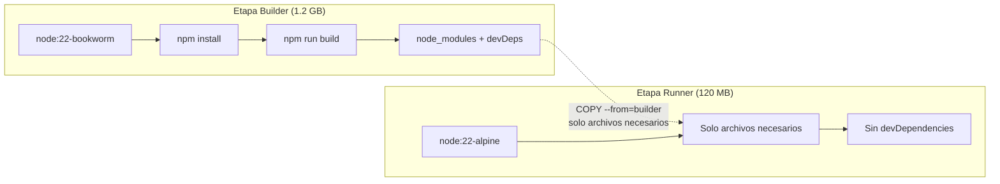

# 🪶 Optimización y Peso Ligero en Imágenes Docker

Aprenderás la filosofía de optimización de imágenes, a elegir la imagen base correcta y a implementar multi-stage builds para reducir drásticamente el tamaño final.

---

## 🎒 Filosofía: La Mochila

> [!info] Regla de oro
> Una imagen Docker es como una mochila. Solo debes llevar lo que necesitas para la excursión, no toda la casa.

**Principio fundamental**: Las capas que cambian menos a menudo deben ir primero en tu `Dockerfile`. Las dependencias (`package.json`) deben copiarse e instalarse **antes** que tu código fuente, que cambia constantemente.

---

## 🏗️ Eligiendo la Imagen Base Correcta

La primera línea (`FROM`) es **la decisión más importante** para el tamaño final.

### Comparativa de imágenes Node.js

| Imagen           | Peso aprox. | Basada en            | ¿Cuándo usarla?                                         |
| :--------------- | :---------- | :------------------- | :------------------------------------------------------ |
| `node:22`        | ~900 MB     | Debian completo      | Solo si necesitas herramientas del sistema              |
| `node:22-slim`   | ~200 MB     | Debian mínimo        | Buena opción si Alpine da problemas con módulos nativos |
| `node:22-alpine` | ~120 MB     | Alpine Linux (~5 MB) | ✅ **Recomendada** para la mayoría de casos             |

### Alpine vs Slim

| Aspecto                | Alpine                                                   | Slim                 |
| :--------------------- | :------------------------------------------------------- | :------------------- |
| **Tamaño base**        | ~5-7 MB                                                  | ~80 MB               |
| **libc**               | `musl libc`                                              | `glibc`              |
| **Compatibilidad**     | Puede tener problemas con algunos módulos nativos de npm | Mayor compatibilidad |
| **Seguridad**          | Muy reducida superficie de ataque                        | Buena                |
| **Gestor de paquetes** | `apk`                                                    | `apt`                |

> [!tip] Regla práctica
> Empieza con `alpine`. Si encuentras problemas de compatibilidad con módulos nativos, cambia a `slim`.

---

## 🏗️ Multi-Stage Build: La Técnica Definitiva

Separa la **construcción** (imagen grande con herramientas) de la **ejecución** (imagen mínima solo con lo necesario).

```dockerfile
# ============================================
# Etapa 1: Builder (construcción)
# ============================================
FROM node:22-bookworm AS builder
WORKDIR /app

# Copiar dependencias primero (capa cacheable)
COPY package*.json ./
RUN npm ci

# Copiar código fuente y construir
COPY . .
RUN npm run build

# ============================================
# Etapa 2: Runner (imagen final mínima)
# ============================================
FROM node:22-alpine AS runner
WORKDIR /app

# Configuración de seguridad y entorno
ENV NODE_ENV=production
RUN addgroup --system --gid 1001 nodejs && \
    adduser --system --uid 1001 nextjs

# Copiar solo lo necesario desde el builder
COPY --from=builder /app/.next/standalone ./
COPY --from=builder /app/.next/static ./.next/static
COPY --from=builder /app/public ./public

USER nextjs
EXPOSE 3000
CMD ["node", "server.js"]
```

### ¿Qué Consigues con Multi-Stage?



| Sin multi-stage                         | Con multi-stage                   |
| :-------------------------------------- | :-------------------------------- |
| ~1.2 GB (incluye herramientas de build) | ~120 MB (solo runtime)            |
| Incluye `devDependencies`               | Solo `dependencies` de producción |
| Mayor superficie de ataque              | Mínima superficie                 |

---

## 📐 Checklist de Optimización

- [ ] Usar imagen base Alpine o Slim en la etapa final
- [ ] Implementar multi-stage build (separar build de runtime)
- [ ] `COPY package*.json` antes que `COPY . .`
- [ ] Usar `npm ci` en vez de `npm install` (más rápido y determinista)
- [ ] Establecer `NODE_ENV=production`
- [ ] Ejecutar como usuario no-root (`USER node`)
- [ ] Usar `.dockerignore` (ver [[04_uso_del_archivo_dockerignore]])
- [ ] Limpiar cachés de gestores de paquetes en la misma capa RUN

---

## 🔗 Notas Relacionadas

- [[03_gestion_de_capas_dockerfile]] — El sistema de capas y la caché
- [[08_busqueda_y_multistage_build]] — Multi-stage builds en profundidad
- [[09_ciclo_de_vida_multistage]] — Ciclo de vida específico para multi-stage
- [[MOC_Dockerfiles]] — Índice general de la categoría Dockerfiles
