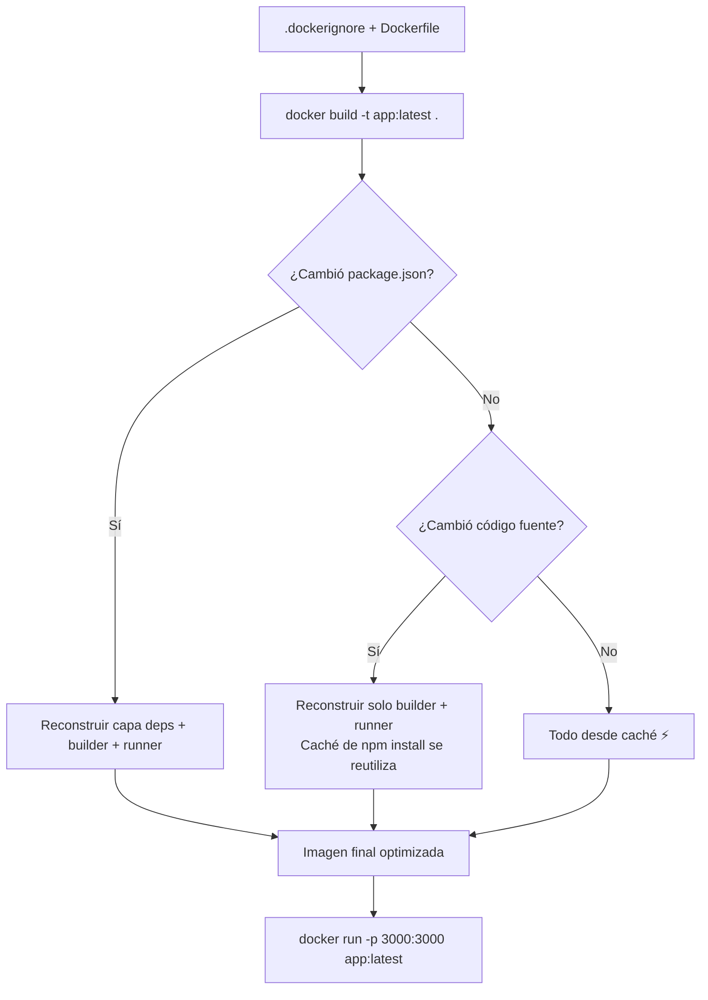

# 🔄 Ciclo de Vida en Imágenes Optimizadas y Ligeras

Guía práctica del ciclo de vida de construcción para imágenes optimizadas con multi-stage builds, aplicada a stacks modernos: Next.js, Astro, React y Hono.

---

## 🧱 Fase 0: Los Cimientos

Dos archivos obligatorios en la raíz de tu proyecto antes de empezar:

### `.dockerignore`

```text
node_modules
.git
.gitignore
.env
.env.*
*.log
.DS_Store
.vscode
.idea
dist
build
.next
.astro
coverage
*.md
*.tmp
*.swp
```

### `next.config.js` (para Next.js standalone)

```javascript
module.exports = {
  output: "standalone",
};
```

---

## 🏗️ Dockerfile Multi-Stage por Framework

### Next.js (con `output: standalone`)

```dockerfile
# Etapa 1: Dependencias
FROM node:22-alpine AS deps
WORKDIR /app
COPY package.json package-lock.json* ./
RUN npm ci --only=production

# Etapa 2: Builder
FROM node:22-alpine AS builder
WORKDIR /app
COPY --from=deps /app/node_modules ./node_modules
COPY . .
RUN npm run build

# Etapa 3: Runner (imagen final ultra-ligera)
FROM node:22-alpine AS runner
WORKDIR /app
ENV NODE_ENV=production
COPY --from=builder /app/.next/standalone ./
COPY --from=builder /app/.next/static ./.next/static
COPY --from=builder /app/public ./public
EXPOSE 3000
USER node
CMD ["node", "server.js"]
```

### Astro (SSR con Node)

```dockerfile
FROM node:22-alpine AS builder
WORKDIR /app
COPY package*.json ./
RUN npm ci
COPY . .
RUN npm run build

FROM node:22-alpine AS runner
WORKDIR /app
ENV NODE_ENV=production
COPY --from=builder /app/dist ./dist
COPY --from=builder /app/node_modules ./node_modules
COPY --from=builder /app/package.json ./
EXPOSE 4321
USER node
CMD ["node", "dist/server/entry.mjs"]
```

### Hono (Backend API)

```dockerfile
FROM node:22-alpine AS builder
WORKDIR /app
COPY package*.json ./
RUN npm ci
COPY . .
RUN npm run build

FROM node:22-alpine AS runner
WORKDIR /app
ENV NODE_ENV=production
COPY --from=builder /app/dist ./dist
COPY --from=builder /app/node_modules ./node_modules
COPY --from=builder /app/package.json ./
EXPOSE 3000
USER node
CMD ["node", "dist/index.js"]
```

---

## 📊 Flujo del Ciclo de Vida



---

## 🧪 Comandos del Ciclo

```bash
# 1. Construir
docker build -t mi-app:latest .

# 2. Verificar tamaño
docker images mi-app

# 3. Ejecutar
docker run -d -p 3000:3000 --name mi-app mi-app:latest

# 4. Ver logs
docker logs -f mi-app

# 5. Actualizar (cambiar código y relanzar)
docker build -t mi-app:latest .
docker rm -f mi-app
docker run -d -p 3000:3000 --name mi-app mi-app:latest
```

---

## 🔗 Notas Relacionadas

- [[05_optimizacion_y_peso_ligero]] — Filosofía de optimización y multi-stage
- [[09_ciclo_de_vida_multistage]] — Ciclo completo: build, push, pull, run
- [[08_ciclo_de_vida_sencillo]] — Ciclo de vida de un contenedor individual
- [[MOC_Dockerfiles]] — Índice general de la categoría Dockerfiles
