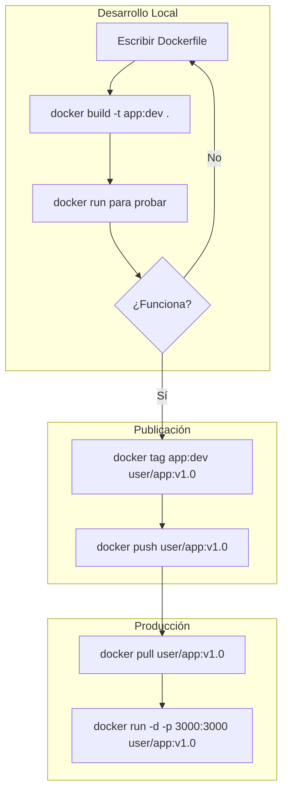

# 🔄 Ciclo de Vida Multi-Stage: Build, Push, Pull y Run

Guía completa del ciclo de vida de una imagen Docker con multi-stage builds: desde la construcción hasta el despliegue, cubriendo tu stack completo (Next.js, Astro, React, Hono, PostgREST, PostgreSQL, SQLite).

---

## 🎯 ¿Por qué Multi-Stage?

Un **multi-stage build** permite usar múltiples instrucciones `FROM` en un mismo Dockerfile. Cada `FROM` inicia una nueva etapa. Puedes copiar selectivamente artefactos de una etapa a otra, dejando fuera todo lo innecesario.

### Beneficios

| Beneficio                           | Impacto                                                    |
| :---------------------------------- | :--------------------------------------------------------- |
| 🗜️ **Imagen hasta 80% más pequeña** | Solo lo necesario para ejecutar                            |
| 🔒 **Mayor seguridad**              | Menos dependencias = menos vulnerabilidades                |
| ⚡ **Caché eficiente**              | Cambios en código no invalidan instalación de dependencias |
| 📄 **Un único Dockerfile**          | Fácil de mantener y versionar                              |

---

## 🗺️ El Ciclo Completo



---

## 🏗️ Dockerfiles Multi-Stage por Stack

### Next.js (output standalone)

```dockerfile
FROM node:22-alpine AS deps
WORKDIR /app
COPY package.json package-lock.json* ./
RUN npm ci --only=production

FROM node:22-alpine AS builder
WORKDIR /app
COPY --from=deps /app/node_modules ./node_modules
COPY . .
RUN npm run build

FROM node:22-alpine AS runner
WORKDIR /app
ENV NODE_ENV=production
COPY --from=builder /app/.next/standalone ./
COPY --from=builder /app/.next/static ./.next/static
COPY --from=builder /app/public ./public
EXPOSE 3000
USER node
CMD ["node", "server.js"]
```

### Astro (SSR Node)

```dockerfile
FROM node:22-alpine AS builder
WORKDIR /app
COPY package*.json ./
RUN npm ci
COPY . .
RUN npm run build

FROM node:22-alpine AS runner
WORKDIR /app
ENV NODE_ENV=production
COPY --from=builder /app/dist ./dist
COPY --from=builder /app/node_modules ./node_modules
COPY --from=builder /app/package.json ./
EXPOSE 4321
USER node
CMD ["node", "dist/server/entry.mjs"]
```

---

## 📋 Comandos del Ciclo

### Build

```bash
# Construir con tag de versión
docker build -t mi-app:1.0.0 .

# Construir sin caché (forzar reconstrucción total)
docker build --no-cache -t mi-app:1.0.0 .
```

### Tag

```bash
# Etiquetar para Docker Hub
docker tag mi-app:1.0.0 mi-usuario/mi-app:1.0.0
docker tag mi-app:1.0.0 mi-usuario/mi-app:latest
```

### Push

```bash
# Iniciar sesión (solo la primera vez)
docker login

# Subir al registry
docker push mi-usuario/mi-app:1.0.0
docker push mi-usuario/mi-app:latest
```

### Pull y Run (en el servidor)

```bash
# Descargar
docker pull mi-usuario/mi-app:1.0.0

# Ejecutar
docker run -d \
  --name mi-app \
  --restart unless-stopped \
  -p 3000:3000 \
  -e NODE_ENV=production \
  mi-usuario/mi-app:1.0.0
```

---

## 🔗 Notas Relacionadas

- [[05_optimizacion_y_peso_ligero]] — Filosofía y técnicas de optimización
- [[07_ciclo_de_vida_en_imagenes_optimizadas]] — Ciclo de vida con frameworks específicos
- [[08_busqueda_y_multistage_build]] — Búsqueda de imágenes y multi-stage
- [[04_despliegue_de_docker_en_vercel]] — Despliegue en Vercel
- [[MOC_Dockerfiles]] — Índice general de la categoría Dockerfiles
