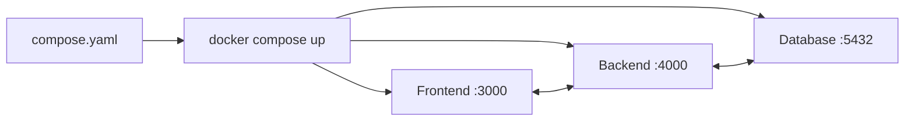

# 🎯 Introducción a Docker Compose: Orquestación Multi-Contenedor

Docker Compose te permite definir y ejecutar aplicaciones multi-contenedor con un solo archivo YAML y un solo comando.

---

## 🧠 ¿Qué es Docker Compose?

Docker Compose es un **orquestador local** que describe toda tu aplicación (frontend + backend + base de datos) en un archivo `compose.yaml`. Con un solo comando levantas todo el ecosistema.



> [!info] Compose vs Kubernetes
>
> - **Compose**: Orquestador local para desarrollo, CI/CD y entornos de prueba
> - **Kubernetes**: Orquestador para producción a gran escala
>
> No son excluyentes. Muchos proyectos usan Compose en desarrollo y Kubernetes en producción.

---

## 📄 `compose.yaml` — El Corazón

El nombre oficial moderno es **`compose.yaml`** (especificación Compose, sin guion). Docker busca automáticamente `compose.yaml` o `docker-compose.yml`.

### Estructura mínima

```yaml
services:
  mi-servicio:
    image: nginx:alpine
    ports:
      - "8080:80"
```

---

## 🏗️ Ejemplo: App Node.js con PostgreSQL

### Estructura del proyecto

```text
mi-app/
├── backend/
│   ├── Dockerfile
│   ├── package.json
│   └── server.js
├── .dockerignore
└── compose.yaml
```

### `.dockerignore`

```text
node_modules
.git
.gitignore
.env
.env.*
Dockerfile
.dockerignore
*.md
.DS_Store
```

### `Dockerfile` (backend)

```dockerfile
FROM node:22-alpine
WORKDIR /app
COPY package*.json ./
RUN npm ci --omit=dev
COPY . .
EXPOSE 3000
USER node
CMD ["node", "server.js"]
```

### `compose.yaml`

```yaml
services:
  backend:
    build: ./backend
    ports:
      - "3000:3000"
    environment:
      NODE_ENV: production
      DATABASE_URL: postgres://user:pass@db:5432/miapp
    depends_on:
      db:
        condition: service_healthy

  db:
    image: postgres:16-alpine
    environment:
      POSTGRES_USER: user
      POSTGRES_PASSWORD: pass
      POSTGRES_DB: miapp
    volumes:
      - pgdata:/var/lib/postgresql/data
    healthcheck:
      test: ["CMD-SHELL", "pg_isready -U user -d miapp"]
      interval: 10s
      retries: 5

volumes:
  pgdata:
```

---

## 🎮 Comandos Esenciales

| Comando                  | Descripción                                 |
| :----------------------- | :------------------------------------------ |
| `docker compose up`      | Levantar todos los servicios (primer plano) |
| `docker compose up -d`   | Levantar en segundo plano                   |
| `docker compose down`    | Detener y eliminar contenedores y redes     |
| `docker compose down -v` | Incluir volúmenes en la eliminación         |
| `docker compose ps`      | Ver estado de los servicios                 |
| `docker compose logs -f` | Logs en tiempo real de todos los servicios  |
| `docker compose build`   | Reconstruir imágenes                        |
| `docker compose restart` | Reiniciar todos los servicios               |

---

## 🔗 Notas Relacionadas

- [[02_sintaxis_y_configuracion_compose_yaml]] — Sintaxis completa del YAML
- [[03_explicacion_y_consejos_de_volumenes]] — Persistencia con volúmenes en Compose
- [[01_crear_docker_monorepo_con_base_de_datos]] — Caso práctico: monorepo con DB
- [[MOC_Compose]] — Índice general de la categoría Compose
