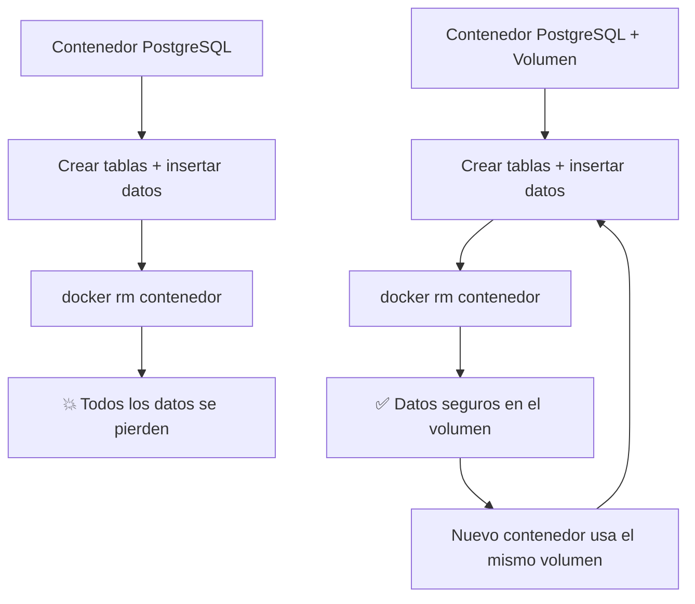

# 💾 Explicación y Consejos de Volúmenes en Docker: Persistencia de Datos

Los contenedores son **efímeros por naturaleza**. Al eliminarlos, todos sus datos desaparecen. Los volúmenes son la solución para persistir datos más allá del ciclo de vida del contenedor.

---

## 🎯 El Problema



> [!info] Definición
> **Volumen**: Mecanismo de almacenamiento gestionado por Docker que persiste datos más allá del ciclo de vida de un contenedor individual. Es la forma **preferida y recomendada** para persistir datos.

---

## 📦 Tipos de Montajes

| Tipo           | Comando                    | Gestionado por | Caso de uso                                 |
| :------------- | :------------------------- | :------------- | :------------------------------------------ |
| **Volume**     | `docker volume create`     | Docker         | ✅ Producción, bases de datos, datos de app |
| **Bind mount** | `-v /ruta/host:/ruta/cont` | El usuario     | Desarrollo, hot reload                      |
| **tmpfs**      | `--tmpfs /ruta`            | RAM (temporal) | Datos sensibles temporales                  |

---

## 🛠️ Comandos de Volúmenes

```bash
# Crear volumen
docker volume create datos-db

# Listar volúmenes
docker volume ls

# Inspeccionar
docker volume inspect datos-db

# Eliminar
docker volume rm datos-db

# Limpiar volúmenes no usados
docker volume prune
```

---

## 🐘 Ejemplo Práctico: PostgreSQL con Volumen

```bash
# 1. Crear volumen
docker volume create datos-db

# 2. Ejecutar PostgreSQL con el volumen
docker run -d \
  --name postgres-container \
  -e POSTGRES_USER=usuario \
  -e POSTGRES_PASSWORD=secreto \
  -e POSTGRES_DB=basedatos \
  -v datos-db:/var/lib/postgresql/data \
  postgres:16-alpine

# 3. Verificar que el volumen está en uso
docker inspect postgres-container | grep -A 5 Mounts
```

### En `compose.yaml`

```yaml
services:
  db:
    image: postgres:16-alpine
    environment:
      POSTGRES_USER: usuario
      POSTGRES_PASSWORD: secreto
      POSTGRES_DB: basedatos
    volumes:
      - datos-db:/var/lib/postgresql/data

volumes:
  datos-db: # Declaración del volumen con nombre
```

---

## ⚠️ Consejos y Buenas Prácticas

> [!warning] Nunca uses bind mounts para bases de datos en producción
> Los bind mounts dependen de la estructura de archivos del host. Los volúmenes gestionados por Docker son portables, tienen mejor rendimiento y se integran con backups.

> [!tip] Nombra siempre tus volúmenes
> `docker volume create datos-db` es mejor que dejar que Docker genere un hash aleatorio. Te permitirá identificar y reutilizar el volumen.

> [!tip] Respaldos de volúmenes
>
> ```bash
> # Backup
> docker run --rm -v datos-db:/data -v $(pwd):/backup alpine tar czf /backup/db-backup.tar.gz -C /data .
>
> # Restore
> docker run --rm -v datos-db:/data -v $(pwd):/backup alpine tar xzf /backup/db-backup.tar.gz -C /data
> ```

---

## 🔗 Notas Relacionadas

- [[01_introduccion_a_docker_compose]] — Uso de volúmenes en Compose
- [[02_sintaxis_y_configuracion_compose_yaml]] — Sintaxis completa de volúmenes en YAML
- [[02_crear_docker_para_base_de_datos]] — Caso práctico con bases de datos
- [[MOC_Compose]] — Índice general de la categoría Compose
