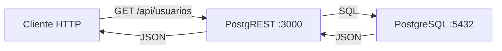

# 🐘 Ejecución de PostgREST en Ubuntu con Docker: API REST desde PostgreSQL

Caso práctico para desplegar PostgREST junto a PostgreSQL, convirtiendo tu base de datos en una API RESTful completa.

---

## 🎯 ¿Qué es PostgREST?

PostgREST convierte **automáticamente** tu base de datos PostgreSQL en una API RESTful. Lees/escribes datos mediante peticiones HTTP sin escribir una sola línea de código backend.



---

## 🏗️ Arquitectura con Docker Compose

```text
proyecto-postgrest/
├── compose.yaml
└── sql/
    └── init.sql
```

### `compose.yaml`

```yaml
services:
  db:
    image: postgres:16-alpine
    environment:
      POSTGRES_USER: postgres
      POSTGRES_PASSWORD: secret
      POSTGRES_DB: api_db
    volumes:
      - pgdata:/var/lib/postgresql/data
      - ./sql/init.sql:/docker-entrypoint-initdb.d/init.sql
    healthcheck:
      test: ["CMD-SHELL", "pg_isready -U postgres"]
      interval: 10s
      retries: 5

  api:
    image: postgrest/postgrest
    ports:
      - "3000:3000"
    environment:
      PGRST_DB_URI: postgres://authenticator:clave_secreta@db:5432/api_db
      PGRST_DB_SCHEMA: api
      PGRST_DB_ANON_ROLE: web_anon
      PGRST_JWT_SECRET: super_secret_jwt_token_32_chars
    depends_on:
      db:
        condition: service_healthy

volumes:
  pgdata:
```

### `sql/init.sql`

```sql
-- Crear esquema
CREATE SCHEMA IF NOT EXISTS api;

-- Roles
CREATE ROLE web_anon NOLOGIN;
CREATE ROLE authenticator LOGIN PASSWORD 'clave_secreta';

GRANT web_anon TO authenticator;

-- Tabla de ejemplo
CREATE TABLE api.usuarios (
    id SERIAL PRIMARY KEY,
    nombre TEXT NOT NULL,
    email TEXT UNIQUE NOT NULL
);

-- Permisos
GRANT SELECT ON api.usuarios TO web_anon;
GRANT USAGE ON SCHEMA api TO web_anon;

-- Datos de prueba
INSERT INTO api.usuarios (nombre, email) VALUES
    ('Ana García', 'ana@example.com'),
    ('Carlos López', 'carlos@example.com');
```

---

## 🚀 Puesta en Marcha

```bash
# 1. Levantar los servicios
docker compose up -d

# 2. Verificar que todo está corriendo
docker compose ps

# 3. Probar la API
curl http://localhost:3000/usuarios
```

### Respuesta esperada

```json
[
  { "id": 1, "nombre": "Ana García", "email": "ana@example.com" },
  { "id": 2, "nombre": "Carlos López", "email": "carlos@example.com" }
]
```

---

## 🔧 Operaciones CRUD

```bash
# GET — Obtener todos los registros
curl http://localhost:3000/usuarios

# GET — Filtrar
curl "http://localhost:3000/usuarios?nombre=eq.Ana%20García"

# GET — Seleccionar columnas
curl "http://localhost:3000/usuarios?select=id,nombre"

# POST — Insertar (requiere rol con permisos de escritura)
curl -X POST http://localhost:3000/usuarios \
  -H "Content-Type: application/json" \
  -d '{"nombre": "María Ruiz", "email": "maria@example.com"}'

# PATCH — Actualizar
curl -X PATCH "http://localhost:3000/usuarios?id=eq.1" \
  -H "Content-Type: application/json" \
  -d '{"nombre": "Ana G. Actualizada"}'

# DELETE — Eliminar
curl -X DELETE "http://localhost:3000/usuarios?id=eq.3"
```

---

## 🧹 Limpieza

```bash
docker compose down -v
```

---

## 🔗 Notas Relacionadas

- [[01_introduccion_a_docker_compose]] — Fundamentos de Docker Compose
- [[03_explicacion_y_consejos_de_volumenes]] — Persistencia de datos con volúmenes
- [[08_busqueda_y_multistage_build]] — Búsqueda de imágenes y multi-stage
- [[MOC_Compose]] — Índice general de la categoría Compose
