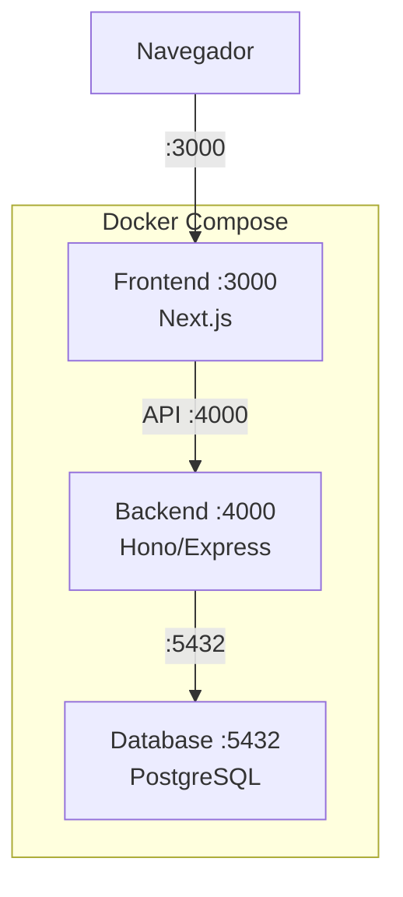

# 🏗️ Crear Docker para Monorepo con Base de Datos

Caso práctico para dockerizar un monorepo completo con frontend, backend y base de datos PostgreSQL.

---

## 📁 Estructura del Proyecto

```text
monorepo/
├── frontend/
│   ├── Dockerfile
│   ├── package.json
│   └── src/
├── backend/
│   ├── Dockerfile
│   ├── package.json
│   └── src/
├── compose.yaml
└── .dockerignore
```

---

## 🏗️ Arquitectura



---

## 📄 `compose.yaml`

```yaml
services:
  frontend:
    build: ./frontend
    ports:
      - "3000:3000"
    environment:
      NEXT_PUBLIC_API_URL: http://localhost:4000
    depends_on:
      - backend

  backend:
    build: ./backend
    ports:
      - "4000:4000"
    environment:
      DATABASE_URL: postgres://admin:secret@db:5432/monorepo
    depends_on:
      db:
        condition: service_healthy

  db:
    image: postgres:16-alpine
    environment:
      POSTGRES_USER: admin
      POSTGRES_PASSWORD: secret
      POSTGRES_DB: monorepo
    volumes:
      - pgdata:/var/lib/postgresql/data
    healthcheck:
      test: ["CMD-SHELL", "pg_isready -U admin -d monorepo"]
      interval: 10s
      retries: 5

volumes:
  pgdata:
```

---

## 🔗 Notas Relacionadas

- [[02_crear_docker_para_base_de_datos]] — Solo base de datos
- [[05_crear_docker_backend_con_base_de_datos]] — Backend + DB
- [[01_introduccion_a_docker_compose]] — Fundamentos de Compose
- [[MOC_Arquitecturas]] — Índice de arquitecturas
