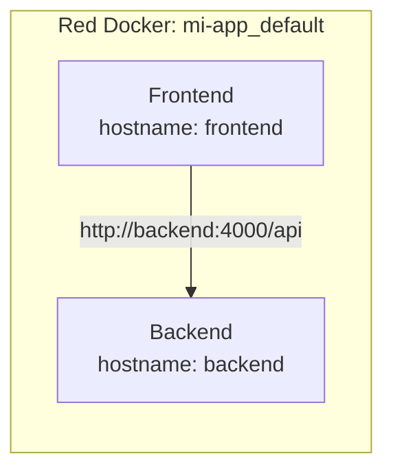

# 🔗 Vincular Frontend y Backend en Docker - Parte 1: Redes Básicas

Aprenderás a conectar un frontend y backend que corren en contenedores Docker separados usando redes bridge.

---

## 🌐 Redes Docker por Defecto

Cuando usas Docker Compose, se crea automáticamente una **red bridge** donde todos los servicios pueden comunicarse usando el nombre del servicio como hostname.



---

## 📄 `compose.yaml` — Vinculación Básica

```yaml
services:
  frontend:
    build: ./frontend
    ports:
      - "3000:3000"
    environment:
      API_URL: http://backend:4000

  backend:
    build: ./backend
    ports:
      - "4000:4000"
```

> [!tip] Regla de oro para nombres de host
> Dentro de la red Docker, usa el **nombre del servicio** como hostname: `http://backend:4000`. Docker resuelve el DNS automáticamente.

---

## 🔗 Notas Relacionadas

- [[02_vincular_frontend_y_backend_parte_2]] — Vinculación avanzada
- [[01_introduccion_a_docker_compose]] — Fundamentos de Compose
- [[MOC_Arquitecturas]] — Índice de arquitecturas
