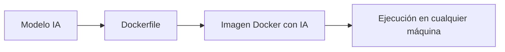

# 🤖 Introducción a Docker e Inteligencia Artificial

Descubre cómo Docker está transformando el despliegue de modelos de IA, LLMs y agentes autónomos.

---

## 🧠 Docker + IA: La Combinación Perfecta

Docker permite empaquetar modelos de IA con todas sus dependencias (Python, CUDA, librerías) en un entorno reproducible.

### Ventajas

- ✅ **Reproducibilidad**: Mismo entorno en dev y prod
- ✅ **Aislamiento**: GPU y dependencias encapsuladas
- ✅ **Escalabilidad**: Fácil de desplegar en cualquier cloud
- ✅ **Versionado**: Modelos versionados junto con su entorno

---

## 🔧 Herramientas Clave

| Herramienta                      | Uso                                         |
| :------------------------------- | :------------------------------------------ |
| **Docker Model Runner**          | Ejecutar modelos LLM localmente             |
| **Ollama**                       | Servir modelos open-source (Llama, Mistral) |
| **Gordon AI**                    | Agente de IA integrado con Docker           |
| **MCP (Model Context Protocol)** | Protocolo para agentes de IA                |

---

## 🔗 Notas Relacionadas

- [[02_construccion_de_aplicaciones_docker_ia]] — Construir apps con IA
- [[03_agente_de_ia_gordon_y_mcp]] — Gordon AI y MCP
- [[MOC_IA_Despliegues]] — Índice de IA y despliegues
