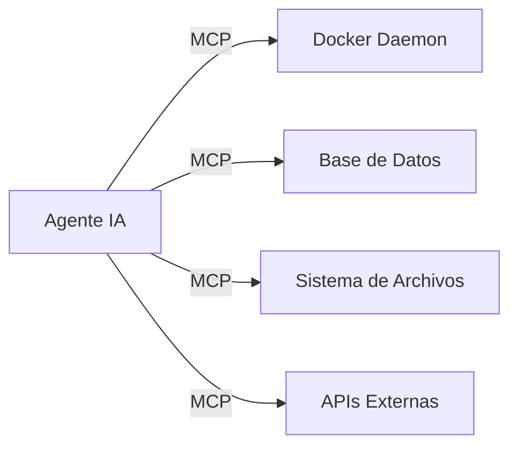

# 🧠 Agente de IA Gordon y MCP: Model Context Protocol en Docker

Exploración del agente Gordon AI de Docker y el Model Context Protocol (MCP) para agentes autónomos.

---

## 🤖 Gordon AI

Gordon es el agente de IA integrado en Docker Desktop que permite:

- **Consultar logs** con lenguaje natural
- **Sugerir optimizaciones** de Dockerfile
- **Depurar errores** de build y runtime
- **Generar configuraciones** de Compose

---

## 🔌 MCP (Model Context Protocol)

MCP es un protocolo abierto que permite a los agentes de IA interactuar con herramientas y datos externos de forma estandarizada.

---

## 🔗 Notas Relacionadas

- [[02_construccion_de_aplicaciones_docker_ia]] — Apps con IA en Docker
- [[01_introduccion_a_docker_e_inteligencia_artificial]] — Fundamentos
- [[MOC_IA_Despliegues]] — Índice de IA y despliegues
