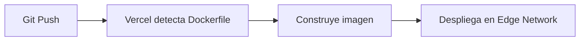

# ☁️ Despliegue de Docker en Vercel: Frontend y APIs Serverless

Guía para desplegar aplicaciones Dockerizadas en Vercel.

---

## 🚀 Flujo de Despliegue



---

## 📄 Dockerfile Optimizado para Vercel

```dockerfile
FROM node:22-alpine AS builder
WORKDIR /app
COPY package*.json ./
RUN npm ci
COPY . .
RUN npm run build

FROM node:22-alpine AS runner
WORKDIR /app
ENV NODE_ENV=production
COPY --from=builder /app/.next/standalone ./
COPY --from=builder /app/.next/static ./.next/static
EXPOSE 3000
CMD ["node", "server.js"]
```

---

## 🔗 Notas Relacionadas

- [[01_introduccion_a_docker_e_inteligencia_artificial]] — IA + Docker
- [[09_ciclo_de_vida_multistage]] — Ciclo multi-stage
- [[MOC_IA_Despliegues]] — Índice de IA y despliegues
