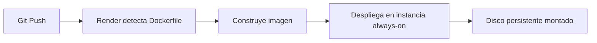

# 🏗️ Despliegue de Docker en Render

Render es la opción **más equilibrada para indies**: precios predecibles, plan gratuito perpetuo y flexibilidad para crecer. Es la alternativa más directa a Vercel para contenedores Docker.

---

## 📊 Características

| Característica                 | Detalle                                                      |
| :----------------------------- | :----------------------------------------------------------- |
| **Modelo**                     | Instancias **always-on**                                     |
| **Precio**                     | Plan gratuito perpetuo (750 h/mes) + planes desde **$7/mes** |
| **Despliegue**                 | Desde repositorio Git (detecta `Dockerfile` automáticamente) |
| **Almacenamiento persistente** | ✅ Sí (discos persistentes)                                  |
| **Escalado**                   | Manual o automático (en planes Pro)                          |
| **Ideal para**                 | Servidores web, APIs, workers en background, cron jobs       |

---

## 🚀 Flujo de Despliegue



---

## 🎯 Ideal para

- Proyectos full-stack estables que necesitan estar siempre activos
- APIs y servidores web con tráfico predecible
- Workers en background y cron jobs
- Indies que quieren **precios fijos sin sorpresas**

---

## ✨ Ventaja Clave

> [!tip] Precios predecibles
> A diferencia de plataformas con facturación por uso, Render ofrece costes fijos mensuales. El plan gratuito incluye 750 horas/mes (suficiente para un contenedor siempre activo).

---

## 📄 Ejemplo de Configuración

Render detecta automáticamente el `Dockerfile` en la raíz del repositorio. No necesitas configuración adicional para empezar.

```dockerfile
FROM node:22-alpine
WORKDIR /app
COPY package*.json ./
RUN npm ci --production
COPY . .
EXPOSE 3000
CMD ["node", "server.js"]
```

---

## 🔗 Enlaces

- **[Render Docker docs](https://render.com/docs/deploy-docker)**
- **[render.com](https://render.com)**

---

## 🔗 Notas Relacionadas

- [[04_despliegue_de_docker_en_vercel]] — Despliegue en Vercel
- [[06_despliegue_de_docker_en_railway]] — Despliegue en Railway
- [[10_despliegue_de_docker_en_self_hosted]] — Alternativa self-hosted
- [[MOC_IA_Despliegues]] — Índice de IA y despliegues
