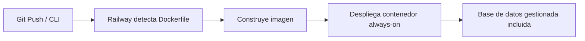

# 🚂 Despliegue de Docker en Railway

Railway es la plataforma **más sencilla** para desplegar contenedores. Experiencia muy fluida, similar a Vercel pero con soporte nativo para Docker y bases de datos gestionadas.

---

## 📊 Características

| Característica                 | Detalle                                           |
| :----------------------------- | :------------------------------------------------ |
| **Modelo**                     | Contenedores **always-on**, sin timeout           |
| **Precio**                     | Plan Hobby desde **$5/mes** (facturación por uso) |
| **Despliegue**                 | Desde repositorio Git o `railway up` (CLI)        |
| **Almacenamiento persistente** | ✅ Sí (volúmenes)                                 |
| **Escalado**                   | Automático                                        |
| **Ideal para**                 | Prototipos full-stack con base de datos integrada |

---

## 🚀 Flujo de Despliegue



---

## 🎯 Ideal para

- Prototipos rápidos full-stack
- Proyectos que necesitan **base de datos + contenedor** en un mismo entorno
- Equipos pequeños que quieren mínima configuración

---

## ✨ Ventaja Clave

> [!tip] Todo en uno
> Railway incluye bases de datos gestionadas (PostgreSQL, MySQL, Redis, MongoDB). No necesitas servicios externos: contenedor + base de datos en la misma plataforma.

---

## 📄 Ejemplo: Despliegue con CLI

```bash
# Instalar CLI
npm i -g @railway/cli

# Login
railway login

# Inicializar proyecto
railway init

# Desplegar
railway up
```

---

## 🔗 Enlaces

- **[Railway Docker docs](https://docs.railway.app/deploy/dockerfiles)**
- **[railway.app](https://railway.app)**

---

## 🔗 Notas Relacionadas

- [[05_despliegue_de_docker_en_render]] — Despliegue en Render
- [[04_despliegue_de_docker_en_vercel]] — Despliegue en Vercel
- [[MOC_IA_Despliegues]] — Índice de IA y despliegues
