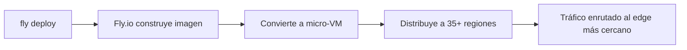

# 🌍 Despliegue de Docker en Fly.io

Fly.io convierte tus imágenes Docker en **micro-VMs globales** desplegadas en más de 35 regiones. Ofrece baja latencia al ejecutar tu app cerca de tus usuarios.

---

## 📊 Características

| Característica                 | Detalle                                                           |
| :----------------------------- | :---------------------------------------------------------------- |
| **Modelo**                     | **Micro-VMs** (usan imágenes Docker)                              |
| **Precio**                     | Por recurso (VM) + tráfico. Plan gratuito con créditos iniciales. |
| **Despliegue**                 | `fly deploy` (CLI)                                                |
| **Almacenamiento persistente** | ✅ Sí (volúmenes persistentes)                                    |
| **Escalado**                   | Automático y global (más de 35 regiones)                          |
| **Ideal para**                 | Apps que necesitan baja latencia global                           |

---

## 🚀 Flujo de Despliegue



---

## 🎯 Ideal para

- Aplicaciones con usuarios distribuidos globalmente
- APIs que necesitan **latencia ultrabaja** en múltiples continentes
- Proyectos que quieren control sin gestionar infraestructura

---

## ✨ Ventaja Clave

> [!tip] Edge global
> Más de 35 regiones. Tu app se ejecuta físicamente cerca de cada usuario, reduciendo la latencia a mínimos. Equilibrio perfecto entre control (micro-VM) y simplicidad (CLI).

---

## 📄 Ejemplo: Despliegue con CLI

```bash
# Instalar CLI
curl -L https://fly.io/install.sh | sh

# Login
fly auth login

# Lanzar app (detecta Dockerfile automáticamente)
fly launch

# Desplegar
fly deploy

# Escalar a más regiones
fly regions add ams  # Ámsterdam
fly regions add syd  # Sídney
```

---

## 🔗 Enlaces

- **[Fly.io Docker docs](https://fly.io/docs/docker/)**
- **[fly.io](https://fly.io)**

---

## 🔗 Notas Relacionadas

- [[05_despliegue_de_docker_en_render]] — Despliegue en Render
- [[08_despliegue_de_docker_en_cloudflare_containers]] — Cloudflare Containers
- [[MOC_IA_Despliegues]] — Índice de IA y despliegues
