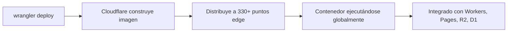

# ⚡ Despliegue de Docker en Cloudflare Containers

Cloudflare Containers ejecuta tus imágenes Docker en la **red perimetral más grande del mundo** (más de 330 regiones), integrado con el ecosistema de Cloudflare (Workers, Pages, R2, D1).

---

## 📊 Características

| Característica                 | Detalle                                        |
| :----------------------------- | :--------------------------------------------- |
| **Modelo**                     | Contenedores en la red **edge** de Cloudflare  |
| **Precio**                     | Por uso (aún en definición, muy competitivo)   |
| **Despliegue**                 | CLI `wrangler`                                 |
| **Almacenamiento persistente** | En desarrollo (R2, D1)                         |
| **Escalado**                   | Global (más de 330 regiones)                   |
| **Ideal para**                 | Proyectos que ya usan el ecosistema Cloudflare |

---

## 🚀 Flujo de Despliegue

---

## 🎯 Ideal para

- Proyectos que ya usan **Cloudflare Workers o Pages**
- Apps que necesitan la **máxima cobertura edge** posible
- Equipos invertidos en el ecosistema Cloudflare (R2, D1, KV, Queues)

---

## ✨ Ventaja Clave

> [!tip] Ecosistema integrado
> Al estar dentro de Cloudflare, tus contenedores se comunican con Workers, Pages, R2 (almacenamiento de objetos), D1 (SQLite edge) y KV (key-value) sin latencia adicional. Todo en la misma red.

---

## ⚠️ Estado Actual

> [!warning] Tecnología en evolución
> Cloudflare Containers está en desarrollo activo. Algunas funcionalidades (como persistencia nativa) aún están madurando. Perfecto para proyectos _cloudflare-first_, pero evalúa si necesitas funcionalidades estables hoy.

---

## 🔗 Enlaces

- **[Cloudflare Containers docs](https://developers.cloudflare.com/containers/)**
- **[Cloudflare Dashboard](https://dash.cloudflare.com)**

---

## 🔗 Notas Relacionadas

- [[07_despliegue_de_docker_en_fly_io]] — Fly.io (edge global)
- [[04_despliegue_de_docker_en_vercel]] — Despliegue en Vercel
- [[MOC_IA_Despliegues]] — Índice de IA y despliegues
