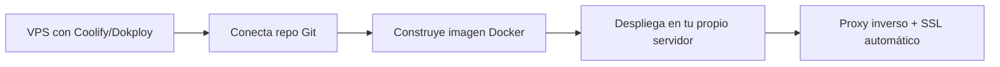

# 🏠 Despliegue de Docker Self-Hosted

Si quieres **control total** y minimizar costes a largo plazo, las plataformas auto-hospedadas te permiten tener tu propio PaaS (similar a Vercel o Heroku) en tu propio servidor VPS.

---

## 🛠️ Herramientas

| Herramienta   | Descripción                                                                          |
| :------------ | :----------------------------------------------------------------------------------- |
| **Coolify**   | PaaS open-source auto-hospedable. Alternativa a Vercel/Heroku en tu propio servidor. |
| **Dokploy**   | Similar a Coolify, con panel de control y API.                                       |
| **Easypanel** | Enfoque en calidad y consistencia de la interfaz.                                    |

---

## 📊 Características Comunes

| Característica                 | Detalle                                               |
| :----------------------------- | :---------------------------------------------------- |
| **Modelo**                     | Tu propio servidor VPS                                |
| **Precio**                     | Coste del VPS (Hetzner ~4€/mes, DigitalOcean ~$6/mes) |
| **Despliegue**                 | Desde repositorio Git (como Vercel/Render)            |
| **Almacenamiento persistente** | ✅ Sí (control total)                                 |
| **Escalado**                   | Ilimitado (depende de tu hardware)                    |
| **Ideal para**                 | Control total, ahorro a largo plazo                   |

---

## 🚀 Flujo de Despliegue



---

## 🎯 Ideal para

- Proyectos con **presupuesto ajustado** a largo plazo
- Necesidad de **control total** sobre infraestructura
- Múltiples proyectos que se benefician de un solo VPS
- Equipos con conocimientos de sysadmin

---

## ✨ Ventaja Clave

> [!tip] Coste fijo, escalado ilimitado
> Un VPS en Hetzner por ~4€/mes puede alojar docenas de proyectos. Frente a pagar $5-7/mes por cada app en plataformas cloud, el ahorro a largo plazo es enorme. Sin límites artificiales de horas, ancho de banda o almacenamiento.

---

## 📄 Ejemplo: Instalación de Coolify

```bash
# En tu VPS (Ubuntu/Debian)
curl -fsSL https://cdn.coollabs.io/coolify/install.sh | bash

# Accede al panel en http://TU_IP:8000
# Conecta tu repo Git y despliega como en Vercel
```

---

## ⚖️ Comparativa de Herramientas

| Característica     | Coolify      | Dokploy        | Easypanel         |
| :----------------- | :----------- | :------------- | :---------------- |
| **Licencia**       | Open-source  | Open-source    | Freemium          |
| **Interfaz**       | Muy completa | Moderna y ágil | Pulida y elegante |
| **Bases de datos** | ✅ Sí        | ✅ Sí          | ✅ Sí             |
| **Multi-servidor** | ✅ Sí        | ✅ Sí          | ❌ Limitado       |
| **API**            | ✅ Sí        | ✅ Sí          | ✅ Sí             |

---

## 🔗 Enlaces

- **[Coolify docs](https://coolify.io/docs)**
- **[Dokploy docs](https://dokploy.com/docs)**
- **[Easypanel docs](https://easypanel.io/docs)**

---

## 🔗 Notas Relacionadas

- [[05_despliegue_de_docker_en_render]] — Alternativa cloud a self-hosted
- [[06_despliegue_de_docker_en_railway]] — Alternativa cloud sencilla
- [[MOC_IA_Despliegues]] — Índice de IA y despliegues
