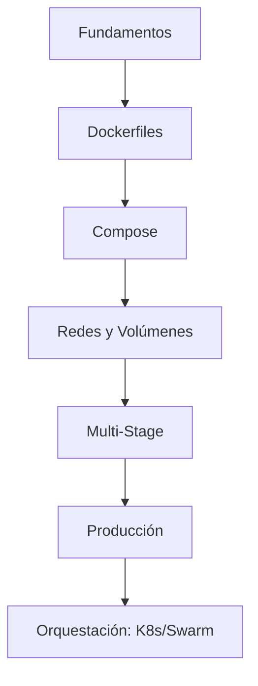

# 📚 Guía Complementaria de Estudio: Ruta de Aprendizaje Docker

Plan de estudio progresivo para dominar Docker desde cero.

---

## 🗺️ Roadmap

---

## 📖 Orden Recomendado

1. [[01_conceptos_y_primeros_pasos]] — Fundamentos
2. [[02_descarga_imagenes_y_creacion_contenedores]] — Primer contenedor
3. [[01_dockerfile_mas_basico]] — Primer Dockerfile
4. [[05_optimizacion_y_peso_ligero]] — Optimización
5. [[01_introduccion_a_docker_compose]] — Compose
6. [[09_ciclo_de_vida_multistage]] — Producción

---

## 🔗 Notas Relacionadas

- [[01_conceptos_y_primeros_pasos]] — Empieza aquí
- [[02_guia_rapida_de_docker]] — Referencia rápida
- [[MOC_Docker_General]] — Índice general
