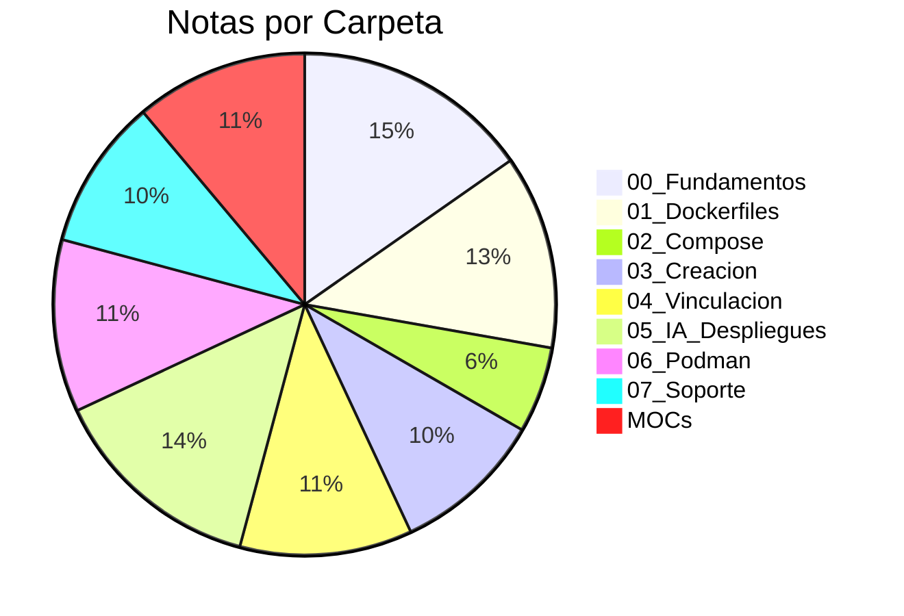

# 📊 Dashboard General del Vault Docker

Vista global del vault: **73 notas** organizadas en **8 carpetas temáticas**, conectadas por **8 MOCs** y clasificadas por tipo, complejidad y categoría.

---

## 🏗️ Estructura del Vault

```text
📁 nuevos-apuntes/
├── 📁 00_Fundamentos_y_Comandos/         11 notas  ⭐ principiante→intermedio
├── 📁 01_Dockerfiles_y_Multistage/        9 notas  📦 principiante→avanzado
├── 📁 02_Docker_Compose_Redes_y_Volumenes/ 4 notas  🐳 intermedio→avanzado
├── 📁 03_Creacion_de_Servicios_y_Arquitecturas/ 7 notas  🏗️ intermedio→avanzado
├── 📁 04_Vinculacion_y_Conexiones_Linkar/ 8 notas  🔗 intermedio→avanzado
├── 📁 05_IA_y_Despliegues_Modernos/      10 notas  🤖 principiante→avanzado
├── 📁 06_Podman_y_Alternativas/           8 notas  🦭 principiante→intermedio
├── 📁 07_Soporte_Guias_y_Recursos/        7 notas  📖 principiante→intermedio
└── 📄 MOC_*.md                            8 índices de contenido
```

---

## 📊 Distribución Global



---

## 📋 Tipos de Contenido

| Type            | Cantidad | Icono | Descripción                     |
| :-------------- | :------- | :---- | :------------------------------ |
| `guia`          | 28       | 📘    | Guías paso a paso y tutoriales  |
| `caso-practico` | 14       | 🛠️    | Ejercicios y ejemplos aplicados |
| `concepto`      | 10       | 💡    | Explicaciones conceptuales      |
| `moc`           | 8        | 🗺️    | Mapas de contenido (índices)    |
| `chuleta`       | 8        | 📝    | Referencias rápidas             |
| `entorno`       | 3        | ⚙️    | Configuración de entornos       |
| `dashboard`     | 1        | 📊    | Dashboards y visualizaciones    |

---

## 📊 Complejidad por Carpeta

```mermaid
xychart-beta
    title "Distribución de Complejidad"
    x-axis ["00_Fundam.", "01_Dockerfiles", "02_Compose", "03_Creacion", "04_Vincul.", "05_IA", "06_Podman", "07_Soporte"]
    y-axis "Notas" 0 --> 12
    bar [8, 3, 0, 0, 0, 2, 5, 5]
    bar [3, 4, 3, 4, 4, 6, 3, 2]
    bar [0, 2, 1, 3, 4, 2, 0, 0]
```



---

## 🏷️ Tags Más Usados

| Tag                  | Cantidad | Carpeta                     |
| :------------------- | :------- | :-------------------------- |
| `docker/fundamentos` | 11       | 00_Fundamentos              |
| `docker/dockerfile`  | 9        | 01_Dockerfiles              |
| `docker/ia`          | 10       | 05_IA_Despliegues           |
| `docker/vinculacion` | 8        | 04_Vinculacion              |
| `docker/compose`     | 8        | 02_Compose + 04_Vinculacion |
| `docker/creacion`    | 7        | 03_Creacion                 |
| `docker/recursos`    | 7        | 07_Soporte                  |
| `podman`             | 8        | 06_Podman                   |
| `moc`                | 8        | MOCs                        |

---

## 🔗 Acceso Rápido

### 🗺️ Mapas de Contenido (MOCs)

- [[MOC_Docker_General]] — Índice central del vault
- [[MOC_Fundamentos]] — Conceptos y comandos básicos
- [[MOC_Dockerfiles]] — Construcción de imágenes
- [[MOC_Compose]] — Orquestación y volúmenes
- [[MOC_Arquitecturas]] — Creación y vinculación de servicios
- [[MOC_IA_Despliegues]] — IA, agentes y plataformas cloud
- [[MOC_Podman]] — Alternativa open-source a Docker
- [[MOC_Soporte]] — Chuletas, guías y recursos

### 📊 Dashboards Específicos

- [[01_dashboard_por_tipo]] — Filtrar por tipo de contenido
- [[02_dashboard_por_complejidad]] — Ruta de aprendizaje
- [[03_dashboard_fundamentos]] — Dashboard de fundamentos
- [[04_dashboard_dockerfiles]] — Dashboard de Dockerfiles
- [[05_dashboard_arquitecturas]] — Dashboard de arquitecturas
- [[06_dashboard_ia_cloud]] — Dashboard de IA y cloud
