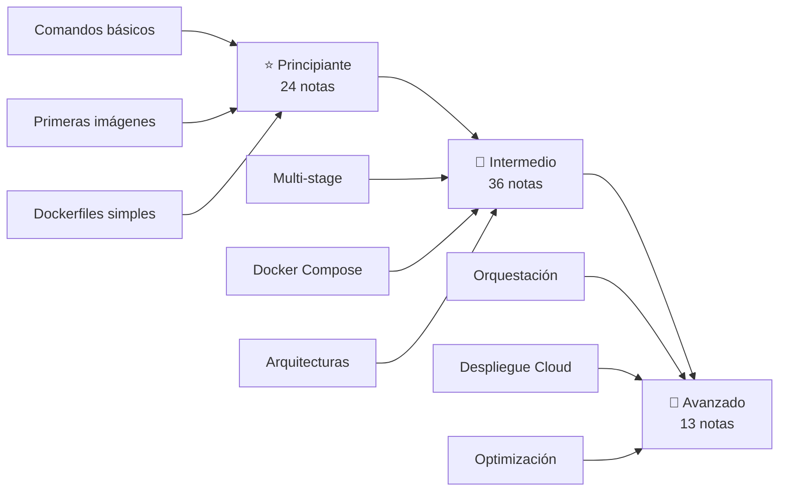

# 🎓 Dashboard por Complejidad: Ruta de Aprendizaje

Ruta progresiva de aprendizaje: **principiante → intermedio → avanzado**. Las 73 notas organizadas de menor a mayor dificultad para que sepas por dónde empezar y cómo avanzar.

---

## 🗺️ Mapa de Progresión



---

## ⭐ Principiante (24 notas)

**Fundamentos y primeros pasos.** Ideal si empiezas con Docker.

| #   | Nota                                                | Carpeta        |
| :-- | :-------------------------------------------------- | :------------- |
| 1   | [[01_conceptos_y_primeros_pasos]]                   | 00_Fundamentos |
| 2   | [[02_descarga_imagenes_y_creacion_contenedores]]    | 00_Fundamentos |
| 3   | [[03_gestion_de_contenedores_ps_commit]]            | 00_Fundamentos |
| 4   | [[04_inspeccion_logs_y_attach]]                     | 00_Fundamentos |
| 5   | [[05_mantenimiento_prune_y_etiquetas]]              | 00_Fundamentos |
| 6   | [[06_gestion_de_imagenes]]                          | 00_Fundamentos |
| 7   | [[08_ciclo_de_vida_sencillo]]                       | 00_Fundamentos |
| 8   | [[10_ejemplo_servidor_web_basico]]                  | 00_Fundamentos |
| 9   | [[01_dockerfile_mas_basico]]                        | 01_Dockerfiles |
| 10  | [[02_primer_dockerfile_paso_a_paso]]                | 01_Dockerfiles |
| 11  | [[03_gestion_de_capas_dockerfile]]                  | 01_Dockerfiles |
| 12  | [[MOC_Fundamentos]]                                 | MOCs           |
| 13  | [[MOC_Soporte]]                                     | MOCs           |
| 14  | [[01_chuleta_general_de_comandos_docker]]           | 07_Soporte     |
| 15  | [[02_guia_rapida_de_docker]]                        | 07_Soporte     |
| 16  | [[03_guia_complementaria_de_estudio]]               | 07_Soporte     |
| 17  | [[05_catalogo_de_imagenes_populares_2026]]          | 07_Soporte     |
| 18  | [[01_instalacion_de_podman_y_docker_en_windows_11]] | 06_Podman      |
| 19  | [[02_diferencia_entre_podman_y_docker_en]]          | 06_Podman      |
| 20  | [[03_alias_docker_a_podman]]                        | 06_Podman      |
| 21  | [[04_chuleta_de_comandos_basicos_podman]]           | 06_Podman      |
| 22  | [[05_chuleta_de_comandos_avanzados_podman]]         | 06_Podman      |
| 23  | [[01_dashboard_por_tipo]]                           | 08_Dashboards  |
| 24  | [[00_dashboard_general]]                            | 08_Dashboards  |

---

## 📘 Intermedio (36 notas)

**Técnicas avanzadas, Compose y arquitecturas.** El grueso del contenido.

| #   | Nota                                                   | Carpeta        |
| :-- | :----------------------------------------------------- | :------------- |
| 1   | [[07_variables_de_entorno_e_inicializacion]]           | 00_Fundamentos |
| 2   | [[09_inicializar_imagen_con_run]]                      | 00_Fundamentos |
| 3   | [[11_eliminacion_y_recarga_en_caliente]]               | 00_Fundamentos |
| 4   | [[04_uso_del_archivo_dockerignore]]                    | 01_Dockerfiles |
| 5   | [[05_optimizacion_y_peso_ligero]]                      | 01_Dockerfiles |
| 6   | [[06_explicacion_y_consejos_de_optimizacion]]          | 01_Dockerfiles |
| 7   | [[07_ciclo_de_vida_en_imagenes_optimizadas]]           | 01_Dockerfiles |
| 8   | [[01_introduccion_a_docker_compose]]                   | 02_Compose     |
| 9   | [[02_sintaxis_y_configuracion_compose_yaml]]           | 02_Compose     |
| 10  | [[03_explicacion_y_consejos_de_volumenes]]             | 02_Compose     |
| 11  | [[01_crear_docker_monorepo_con_base_de_datos]]         | 03_Creacion    |
| 12  | [[02_crear_docker_para_base_de_datos]]                 | 03_Creacion    |
| 13  | [[03_crear_docker_para_frontend]]                      | 03_Creacion    |
| 14  | [[04_crear_docker_para_backend]]                       | 03_Creacion    |
| 15  | [[05_crear_docker_backend_con_base_de_datos]]          | 03_Creacion    |
| 16  | [[01_vincular_frontend_y_backend_parte_1]]             | 04_Vinculacion |
| 17  | [[02_vincular_frontend_y_backend_parte_2]]             | 04_Vinculacion |
| 18  | [[03_vincular_backend_apirest_y_frontend]]             | 04_Vinculacion |
| 19  | [[04_vincular_backend_con_frontend_variante_2]]        | 04_Vinculacion |
| 20  | [[05_vincular_backend_con_base_de_datos]]              | 04_Vinculacion |
| 21  | [[01_introduccion_a_docker_e_inteligencia_artificial]] | 05_IA          |
| 22  | [[02_construccion_de_aplicaciones_docker_ia]]          | 05_IA          |
| 23  | [[03_agente_de_ia_gordon_y_mcp]]                       | 05_IA          |
| 24  | [[04_despliegue_de_docker_en_vercel]]                  | 05_IA          |
| 25  | [[05_despliegue_de_docker_en_render]]                  | 05_IA          |
| 26  | [[06_despliegue_de_docker_en_railway]]                 | 05_IA          |
| 27  | [[07_despliegue_de_docker_en_fly_io]]                  | 05_IA          |
| 28  | [[09_despliegue_de_docker_en_heroku]]                  | 05_IA          |
| 29  | [[06_uso_y_configuracion_de_podman_desktop]]           | 06_Podman      |
| 30  | [[08_despliegue_de_postgresql_y_pgadmin4_en_podman]]   | 06_Podman      |
| 31  | [[04_dockerignore_para_frontend_moderno]]              | 07_Soporte     |
| 32  | [[07_guia_extensa_de_docker]]                          | 07_Soporte     |
| 33  | [[MOC_Docker_General]]                                 | MOCs           |
| 34  | [[MOC_Dockerfiles]]                                    | MOCs           |
| 35  | [[MOC_IA_Despliegues]]                                 | MOCs           |
| 36  | [[MOC_Podman]]                                         | MOCs           |

---

## 🚀 Avanzado (13 notas)

**Orquestación compleja, multi-stage, despliegues avanzados.** El nivel experto.

| #   | Nota                                                 | Carpeta        |
| :-- | :--------------------------------------------------- | :------------- |
| 1   | [[08_busqueda_y_multistage_build]]                   | 01_Dockerfiles |
| 2   | [[09_ciclo_de_vida_multistage]]                      | 01_Dockerfiles |
| 3   | [[04_ejecucion_postgrest_ubuntu]]                    | 02_Compose     |
| 4   | [[07_crear_docker_backend_apirest_con_database]]     | 03_Creacion    |
| 5   | [[06_crear_docker_backend_apirest]]                  | 04_Vinculacion |
| 6   | [[06_vincular_backend_base_de_datos_y_frontend_v1]]  | 04_Vinculacion |
| 7   | [[07_vincular_frontend_nextjs_y_database]]           | 04_Vinculacion |
| 8   | [[08_vincular_backend_base_de_datos_y_frontend_v2]]  | 04_Vinculacion |
| 9   | [[08_despliegue_de_docker_en_cloudflare_containers]] | 05_IA          |
| 10  | [[10_despliegue_de_docker_en_self_hosted]]           | 05_IA          |
| 11  | [[MOC_Compose]]                                      | MOCs           |
| 12  | [[MOC_Arquitecturas]]                                | MOCs           |
| 13  | [[06_enlaces_oficiales_y_recursos_comunitarios]]     | 07_Soporte     |

---

## 🎯 Ruta Recomendada

```text
⭐ PRINCIPIANTE                        📘 INTERMEDIO                         🚀 AVANZADO
───────────────                        ────────────                         ────────────
01_conceptos_y_primeros_pasos  →  01_introduccion_a_docker_compose  →  08_busqueda_y_multistage
02_descarga_imagenes           →  01_crear_docker_monorepo          →  09_ciclo_de_vida_multistage
01_dockerfile_mas_basico       →  01_vincular_frontend_y_backend    →  06_docker_compose_frontend
03_gestion_de_capas            →  05_optimizacion_y_peso_ligero     →  08_uso_de_healthcheck
MOC_Fundamentos                →  02_sintaxis_y_configuracion       →  10_self_hosted
```

---

## 🔗 Notas Relacionadas

- [[00_dashboard_general]] — Dashboard general
- [[01_dashboard_por_tipo]] — Filtrar por tipo
- [[MOC_Docker_General]] — Índice central
