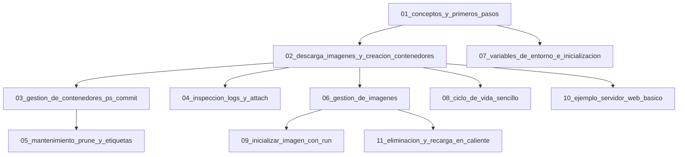
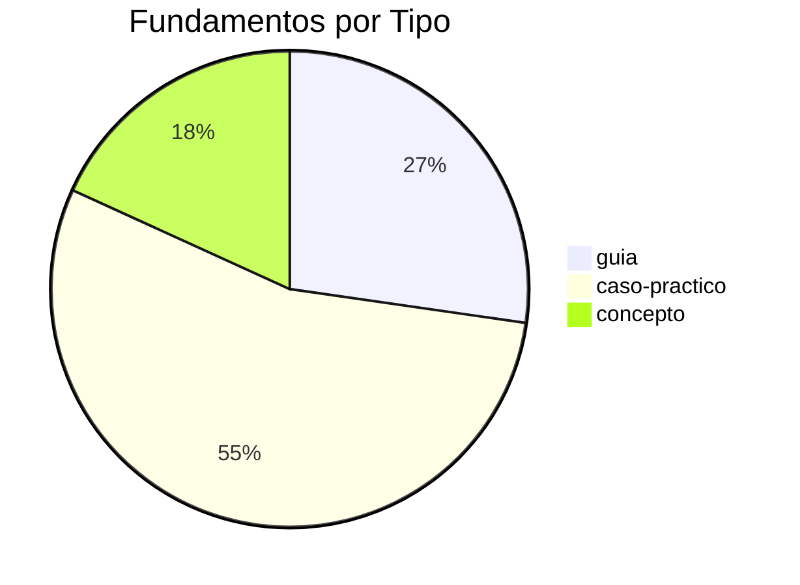

# 🧱 Dashboard de Fundamentos y Comandos Docker

Las **11 notas** de la carpeta `00_Fundamentos_y_Comandos/`: la base imprescindible para empezar con Docker.

---

## 🗺️ Mapa de Contenido



---

## 📊 Vista General

| #   | Nota                                             | Type          | Complexity   | Tags                                             |
| :-- | :----------------------------------------------- | :------------ | :----------- | :----------------------------------------------- |
| 1   | [[01_conceptos_y_primeros_pasos]]                | guia          | principiante | `docker/fundamentos`, `docker/introduccion`      |
| 2   | [[02_descarga_imagenes_y_creacion_contenedores]] | caso-practico | principiante | `docker/fundamentos`, `docker/docker-run`        |
| 3   | [[03_gestion_de_contenedores_ps_commit]]         | caso-practico | principiante | `docker/fundamentos`, `docker/docker-ps`         |
| 4   | [[04_inspeccion_logs_y_attach]]                  | caso-practico | principiante | `docker/fundamentos`, `docker/docker-logs`       |
| 5   | [[05_mantenimiento_prune_y_etiquetas]]           | caso-practico | principiante | `docker/fundamentos`, `docker/prune`             |
| 6   | [[06_gestion_de_imagenes]]                       | concepto      | principiante | `docker/fundamentos`, `docker/imagenes`          |
| 7   | [[07_variables_de_entorno_e_inicializacion]]     | concepto      | intermedio   | `docker/fundamentos`, `docker/variables-entorno` |
| 8   | [[08_ciclo_de_vida_sencillo]]                    | guia          | principiante | `docker/fundamentos`, `docker/ciclo-de-vida`     |
| 9   | [[09_inicializar_imagen_con_run]]                | caso-practico | intermedio   | `docker/fundamentos`, `docker/docker-run`        |
| 10  | [[10_ejemplo_servidor_web_basico]]               | guia          | principiante | `docker/fundamentos`, `docker/caso-practico`     |
| 11  | [[11_eliminacion_y_recarga_en_caliente]]         | caso-practico | intermedio   | `docker/fundamentos`, `docker/docker-rmi`        |

---

## 📈 Distribución



---

## 🎯 Ruta de Aprendizaje Rápida

```text
⭐ PRINCIPIANTE (1-2 horas)            📘 INTERMEDIO (completar)
───────────────────────────            ─────────────────────
01_conceptos_y_primeros_pasos    →   07_variables_de_entorno
02_descarga_imagenes              →   09_inicializar_imagen_con_run
03_gestion_de_contenedores        →   11_eliminacion_y_recarga
04_inspeccion_logs_y_attach
05_mantenimiento_prune
06_gestion_de_imagenes
08_ciclo_de_vida_sencillo
10_ejemplo_servidor_web_basico
```

---

## 🏷️ Tags de Fundamentos

| Tag                        | Cantidad | Notas           |
| :------------------------- | :------- | :-------------- |
| `docker/fundamentos`       | 11       | Todas las notas |
| `docker/introduccion`      | 2        | 01, 02          |
| `docker/docker-run`        | 2        | 02, 09          |
| `docker/docker-ps`         | 1        | 03              |
| `docker/docker-commit`     | 1        | 03              |
| `docker/docker-logs`       | 1        | 04              |
| `docker/docker-attach`     | 1        | 04              |
| `docker/prune`             | 1        | 05              |
| `docker/labels`            | 1        | 05              |
| `docker/imagenes`          | 2        | 06, 11          |
| `docker/variables-entorno` | 1        | 07              |
| `docker/ciclo-de-vida`     | 2        | 08, 09          |
| `docker/docker-rmi`        | 1        | 11              |

---

## 🔗 Notas Relacionadas

- [[MOC_Fundamentos]] — Índice completo de fundamentos
- [[00_dashboard_general]] — Dashboard general
- [[02_dashboard_por_complejidad]] — Ruta de aprendizaje
- [[MOC_Docker_General]] — Índice central
