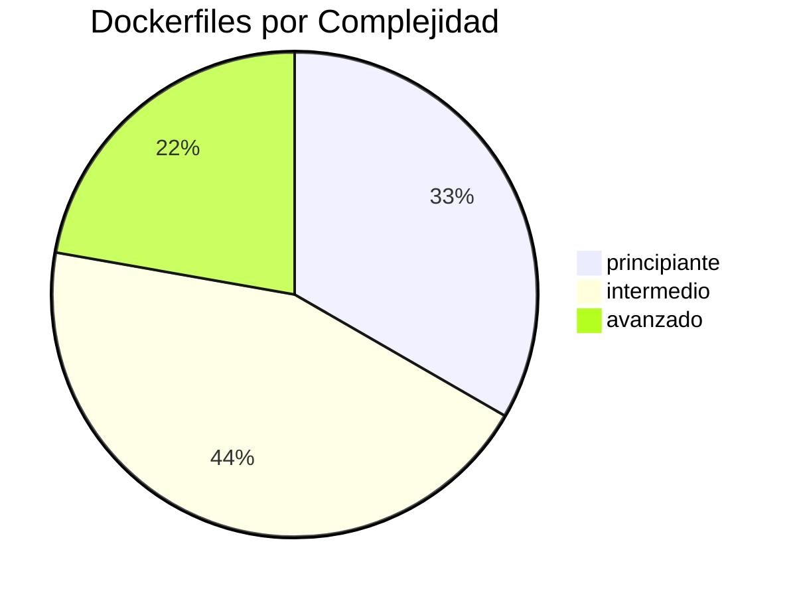

# 📄 Dashboard de Dockerfiles y Multi-Stage Builds

Las **9 notas** de `01_Dockerfiles_y_Multistage/`: desde tu primer `Dockerfile` hasta builds multi-stage avanzados.

---

## 🏗️ Progresión Visual

```text
01_dockerfile_mas_basico
        │  FROM + CMD
        ▼
02_primer_dockerfile_paso_a_paso
        │  Alpine + variables
        ▼
03_gestion_de_capas_dockerfile
        │  Caché y capas
        ▼
04_uso_del_archivo_dockerignore
        │  Optimizar contexto
        ▼
05_optimizacion_y_peso_ligero
        │  Imagen base + multi-stage
        ▼
06_explicacion_y_consejos_de_optimizacion
        │  Buenas prácticas
        ▼
07_ciclo_de_vida_en_imagenes_optimizadas
        │  Next.js, Astro, Hono
        ▼
08_busqueda_y_multistage_build
        │  `docker search` + PostgREST
        ▼
09_ciclo_de_vida_multistage
           Build → Push → Run
```

---

## 📊 Vista General

| #   | Nota                                          | Type          | Complexity   | Foco                              |
| :-- | :-------------------------------------------- | :------------ | :----------- | :-------------------------------- |
| 1   | [[01_dockerfile_mas_basico]]                  | guia          | principiante | `FROM`, `CMD`, `docker build`     |
| 2   | [[02_primer_dockerfile_paso_a_paso]]          | caso-practico | principiante | Alpine, `WORKDIR`, `COPY`         |
| 3   | [[03_gestion_de_capas_dockerfile]]            | concepto      | principiante | Capas, caché, orden               |
| 4   | [[04_uso_del_archivo_dockerignore]]           | caso-practico | intermedio   | `.dockerignore`, contexto         |
| 5   | [[05_optimizacion_y_peso_ligero]]             | guia          | intermedio   | Multi-stage, Alpine, slim         |
| 6   | [[06_explicacion_y_consejos_de_optimizacion]] | guia          | intermedio   | Buenas prácticas, `RUN` combinado |
| 7   | [[07_ciclo_de_vida_en_imagenes_optimizadas]]  | guia          | intermedio   | Next.js, Astro, Hono              |
| 8   | [[08_busqueda_y_multistage_build]]            | guia          | avanzado     | `docker search`, PostgREST        |
| 9   | [[09_ciclo_de_vida_multistage]]               | guia          | avanzado     | Build → Tag → Push → Run          |

---

## 📈 Distribución



---

## 🏷️ Tags de Dockerfiles

| Tag                   | Cantidad |
| :-------------------- | :------- |
| `docker/dockerfile`   | 9        |
| `docker/capas`        | 3        |
| `docker/optimizacion` | 3        |
| `docker/multi-stage`  | 2        |
| `docker/alpine`       | 2        |
| `docker/build`        | 2        |

---

## 🎯 Ejemplo Destacado: Multi-Stage con Next.js

```dockerfile
# Etapa 1: Builder
FROM node:22-alpine AS builder
WORKDIR /app
COPY package*.json ./
RUN npm ci
COPY . .
RUN npm run build

# Etapa 2: Runner (imagen final ligera ~50 MB)
FROM node:22-alpine AS runner
WORKDIR /app
ENV NODE_ENV=production
COPY --from=builder /app/.next/standalone ./
COPY --from=builder /app/.next/static ./.next/static
EXPOSE 3000
CMD ["node", "server.js"]
```

---

## 🔗 Notas Relacionadas

- [[MOC_Dockerfiles]] — Índice completo de Dockerfiles
- [[MOC_Fundamentos]] — Pre-requisito
- [[03_dashboard_fundamentos]] — Dashboard de fundamentos
- [[00_dashboard_general]] — Dashboard general
