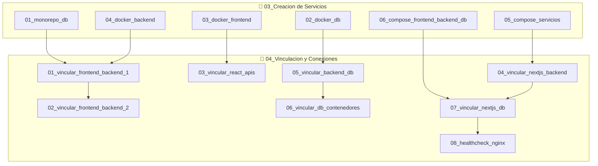
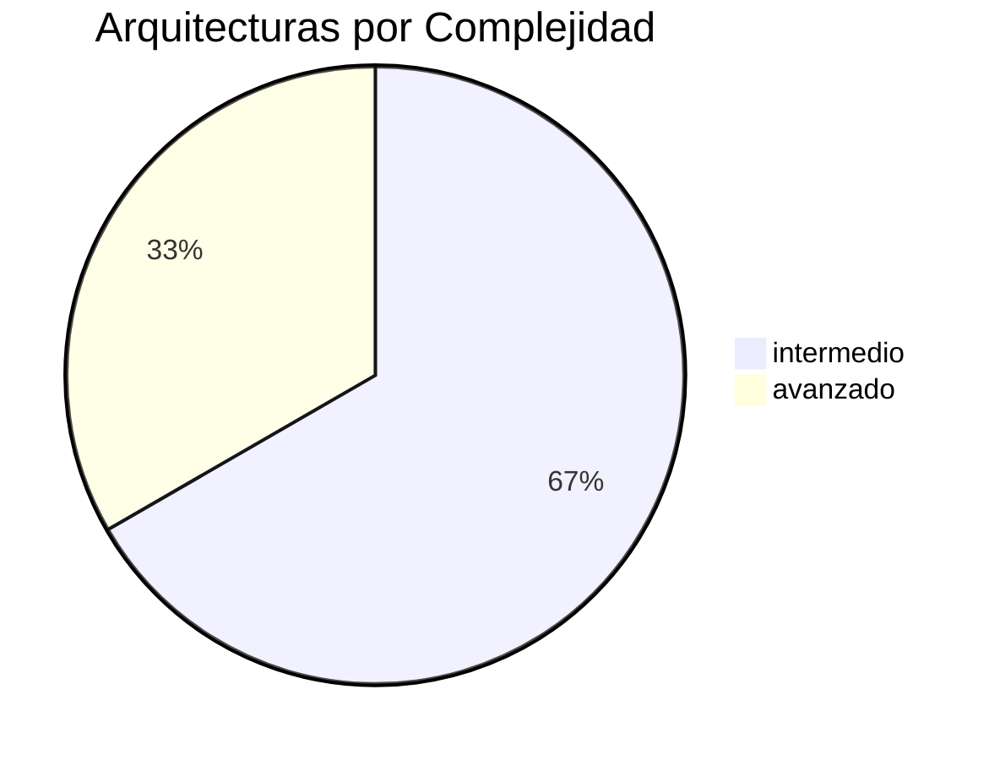

# 🏗️ Dashboard de Arquitecturas: Creación y Vinculación de Servicios

**15 notas** distribuidas en dos carpetas: `03_Creacion_de_Servicios` (7) y `04_Vinculacion_y_Conexiones` (8). Cubre cómo dockerizar y conectar servicios reales.

---

## 🗺️ Mapa de Arquitecturas



---

## 🔨 Creación de Servicios (7 notas)

| #   | Nota                                           | Type     | Complexity |
| :-- | :--------------------------------------------- | :------- | :--------- |
| 1   | [[01_crear_docker_monorepo_con_base_de_datos]] | guia     | intermedio |
| 2   | [[02_crear_docker_para_base_de_datos]]         | guia     | intermedio |
| 3   | [[03_crear_docker_para_frontend]]              | guia     | intermedio |
| 4   | [[04_crear_docker_para_backend]]               | guia     | intermedio |
| 5   | [[05_crear_docker_backend_con_base_de_datos]]      | concepto | intermedio |
| 6   | [[07_crear_docker_backend_apirest_con_database]]      | concepto | avanzado   |

---

## 🔗 Vinculación y Conexiones (8 notas)

| #   | Nota                                              | Type          | Complexity |
| :-- | :------------------------------------------------ | :------------ | :--------- |
| 1   | [[01_vincular_frontend_y_backend_parte_1]]        | guia          | intermedio |
| 2   | [[02_vincular_frontend_y_backend_parte_2]]        | guia          | intermedio |
| 3   | [[03_vincular_backend_apirest_y_frontend]]             | concepto      | intermedio |
| 4   | [[04_vincular_backend_con_frontend_variante_2]]       | guia          | intermedio |
| 5   | [[05_vincular_backend_con_base_de_datos]]         | guia          | intermedio |
| 6   | [[06_vincular_backend_base_de_datos_y_frontend_v1]] | concepto      | avanzado   |
| 7   | [[07_vincular_frontend_nextjs_y_database]]        | guia          | avanzado   |
| 8   | [[08_vincular_backend_base_de_datos_y_frontend_v2]]           | caso-practico | avanzado   |

---

## 📈 Distribución



---

## 🏷️ Tags de Arquitecturas

| Tag                  | Cantidad | Carpeta        |
| :------------------- | :------- | :------------- |
| `docker/creacion`    | 7        | 03_Creacion    |
| `docker/vinculacion` | 8        | 04_Vinculacion |
| `docker/compose`     | 5        | 03 + 04        |
| `docker/redes`       | 4        | 04_Vinculacion |
| `docker/healthcheck` | 2        | 04_Vinculacion |
| `docker/nginx`       | 2        | 04_Vinculacion |
| `stack/nextjs`       | 3        | 03 + 04        |
| `stack/react`        | 2        | 04_Vinculacion |
| `stack/postgresql`   | 3        | 03_Creacion    |

---

## 🎯 Patrones de Arquitectura

```text
┌─────────────────────────────────────────────────────┐
│  PATRÓN 1: Frontend + Backend + DB (Compose)        │
│                                                     │
│  ┌──────────┐   ┌──────────┐   ┌──────────┐        │
│  │ Frontend │──▶│ Backend  │──▶│ Database  │        │
│  │ :3000    │   │ :4000    │   │ :5432    │        │
│  └──────────┘   └──────────┘   └──────────┘        │
│       ↑                            ↑               │
│  03_crear_frontend           02_crear_db           │
└─────────────────────────────────────────────────────┘

┌─────────────────────────────────────────────────────┐
│  PATRÓN 2: Next.js + API + PostgreSQL               │
│                                                     │
│  ┌──────────┐   ┌──────────┐   ┌──────────┐        │
│  │ Next.js  │──▶│  API     │──▶│PostgreSQL │        │
│  │  (SSR)   │   │  (Hono)  │   │  :5432   │        │
│  └──────────┘   └──────────┘   └──────────┘        │
│       ↑                            ↑               │
│  04_vincular_nextjs          05_vincular_db        │
└─────────────────────────────────────────────────────┘

┌─────────────────────────────────────────────────────┐
│  PATRÓN 3: Proxy con Nginx + Healthcheck            │
│                                                     │
│  ┌──────────┐                                      │
│  │  Nginx   │──▶ Backend ──▶ DB                    │
│  │  :80     │                                      │
│  └──────────┘                                      │
│       ↑                                            │
│  08_healthcheck_nginx                              │
└─────────────────────────────────────────────────────┘
```

---

## 🔗 Notas Relacionadas

- [[MOC_Arquitecturas]] — Índice completo de arquitecturas
- [[MOC_Compose]] — Docker Compose
- [[04_dashboard_dockerfiles]] — Dashboard de Dockerfiles
- [[00_dashboard_general]] — Dashboard general
