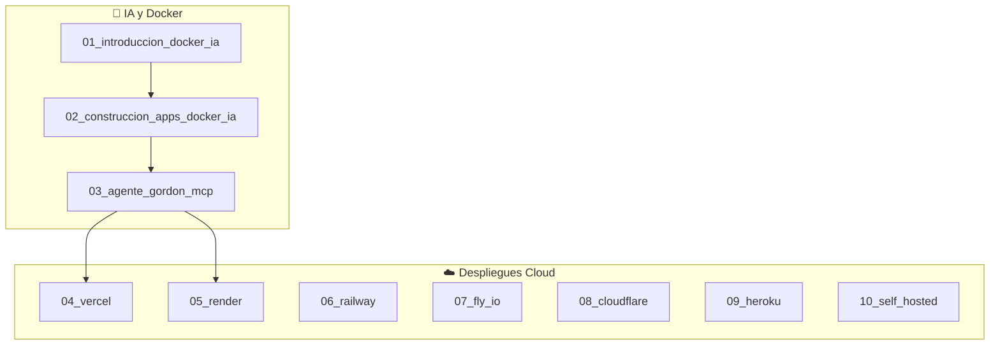
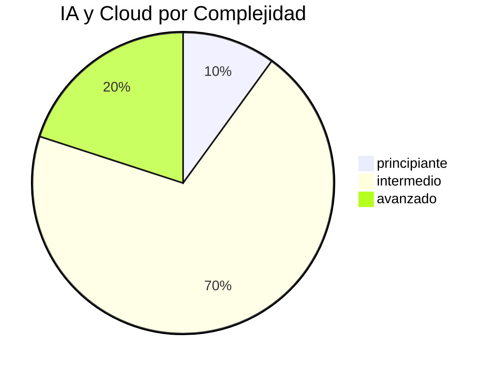

# 🤖 Dashboard de IA, Agentes y Despliegues Cloud

Las **10 notas** de `05_IA_y_Despliegues_Modernos/`: desde Docker + IA generativa hasta el despliegue en 7 plataformas cloud.

---

## 🗺️ Mapa de Contenido



---

## 🧠 IA y Docker (3 notas)

| #   | Nota                                                   | Type          | Complexity | Foco                   |
| :-- | :----------------------------------------------------- | :------------ | :--------- | :--------------------- |
| 1   | [[01_introduccion_a_docker_e_inteligencia_artificial]] | concepto      | intermedio | Conceptos IA + Docker  |
| 2   | [[02_construccion_de_aplicaciones_docker_ia]]          | guia          | intermedio | Model Runner, Ollama   |
| 3   | [[03_agente_de_ia_gordon_y_mcp]]                       | caso-practico | intermedio | Gordon AI, MCP Toolkit |

---

## ☁️ Despliegues Cloud (7 notas)

| #   | Nota                                                 | Type | Complexity   | Modelo             |
| :-- | :--------------------------------------------------- | :--- | :----------- | :----------------- |
| 4   | [[04_despliegue_de_docker_en_vercel]]                | guia | intermedio   | Serverless Edge    |
| 5   | [[05_despliegue_de_docker_en_render]]                | guia | intermedio   | Always-on          |
| 6   | [[06_despliegue_de_docker_en_railway]]               | guia | principiante | Always-on + DB     |
| 7   | [[07_despliegue_de_docker_en_fly_io]]                | guia | intermedio   | Micro-VMs globales |
| 8   | [[08_despliegue_de_docker_en_cloudflare_containers]] | guia | avanzado     | Edge global        |
| 9   | [[09_despliegue_de_docker_en_heroku]]                | guia | intermedio   | Dynos clásicos     |
| 10  | [[10_despliegue_de_docker_en_self_hosted]]           | guia | avanzado     | Coolify, Dokploy   |

---

## 📊 Comparativa de Plataformas Cloud

| Plataforma      | Precio desde | Persistencia | Complejidad | Ideal para         |
| :-------------- | :----------- | :----------- | :---------- | :----------------- |
| **Vercel**      | Gratis       | ❌ No        | ⭐⭐        | Frontend + APIs    |
| **Render**      | Gratis / $7  | ✅ Sí        | ⭐⭐        | Proyectos estables |
| **Railway**     | $5           | ✅ Sí        | ⭐          | Prototipos rápidos |
| **Fly.io**      | Por uso      | ✅ Sí        | ⭐⭐⭐      | Apps globales      |
| **Cloudflare**  | Por uso      | Parcial      | ⭐⭐⭐⭐    | Edge + Workers     |
| **Heroku**      | $5           | ❌ No        | ⭐⭐        | Legacy / add-ons   |
| **Self-Hosted** | ~$4 VPS      | ✅ Sí        | ⭐⭐⭐⭐    | Control total      |

---

## 📈 Distribución



---

## 🏷️ Tags de IA y Cloud

| Tag                  | Cantidad | Sección     |
| :------------------- | :------- | :---------- |
| `docker/ia`          | 3        | IA          |
| `docker/cloud`       | 7        | Despliegues |
| `docker/despliegue`  | 7        | Despliegues |
| `docker/render`      | 1        | Render      |
| `docker/railway`     | 1        | Railway     |
| `docker/fly-io`      | 1        | Fly.io      |
| `docker/cloudflare`  | 1        | Cloudflare  |
| `docker/heroku`      | 1        | Heroku      |
| `docker/self-hosted` | 1        | Self-hosted |

---

## 🎯 Recomendación de Despliegue

```text
¿Qué plataforma elegir?
════════════════════════

Proyecto personal / indie  →  Render (gratis, precios fijos)
Prototipo rápido + DB      →  Railway ($5, todo en uno)
App global / baja latencia →  Fly.io (35+ regiones)
Ecosistema Cloudflare      →  Cloudflare Containers
Control total / ahorro     →  Self-Hosted (Coolify en VPS)
Migrar desde Heroku        →  Heroku (seguir donde estás)
```

---

## 🔗 Notas Relacionadas

- [[MOC_IA_Despliegues]] — Índice completo de IA y despliegues
- [[05_dashboard_arquitecturas]] — Dashboard de arquitecturas
- [[00_dashboard_general]] — Dashboard general
- [[MOC_Docker_General]] — Índice central
