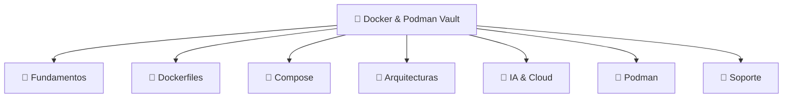

# 🐳 MOC Docker General

Índice central del Vault de Docker, Podman y ecosistema de contenedores.

---

## 🗺️ Mapa General

---

## 📋 Índices por Categoría

| MOC                      | Categoría                           | Descripción                                     |
| :----------------------- | :---------------------------------- | :---------------------------------------------- |
| [[MOC_Fundamentos]]      | Fundamentos y comandos              | `docker run`, `ps`, `logs`, ciclo de vida       |
| [[MOC_Dockerfiles]]      | Dockerfiles y Multi-Stage           | FROM, capas, optimización, multi-stage          |
| [[MOC_Compose]]          | Docker Compose, redes y volúmenes   | `compose.yaml`, persistencia, PostgREST         |
| [[MOC_Arquitecturas]]    | Creación y vinculación de servicios | Monorepo, frontend+backend+DB                   |
| [[MOC_IA_Despliegues]]   | IA y despliegues modernos           | Ollama, Gordon, MCP, Vercel                     |
| [[MOC_Podman]]           | Podman y alternativas               | Instalación, comandos, pods                     |
| [[MOC_Soporte]]          | Soporte, guías y recursos           | Chuletas, catálogos, enlaces oficiales          |
| [[00_dashboard_general]] | Dashboards y visualizaciones        | Vistas globales, filtros por tipo y complejidad |

---

## 📊 Dashboards y Visualizaciones

- [[00_dashboard_general]] — Dashboard general del vault (estadísticas, MOCs, tags)
- [[01_dashboard_por_tipo]] — Filtrar contenido por tipo (guía, chuleta, concepto...)
- [[02_dashboard_por_complejidad]] — Ruta de aprendizaje progresiva
- [[03_dashboard_fundamentos]] — Dashboard de fundamentos Docker
- [[04_dashboard_dockerfiles]] — Dashboard de Dockerfiles y multi-stage
- [[05_dashboard_arquitecturas]] — Dashboard de arquitecturas y vinculación
- [[06_dashboard_ia_cloud]] — Dashboard de IA y despliegues cloud

## 🎨 Canvas Interactivos

- [[00_mapa_conocimiento_general]] — Red visual de todos los MOCs
- [[01_flujo_aprendizaje]] — Ruta visual de aprendizaje en 5 fases
- [[02_arquitecturas_docker]] — Patrones visuales de arquitectura Docker

---

## 🔗 Notas Relacionadas

- [[MOC_Fundamentos]] — Fundamentos
- [[MOC_Dockerfiles]] — Dockerfiles
- [[MOC_Compose]] — Compose
- [[MOC_Arquitecturas]] — Arquitecturas
- [[MOC_IA_Despliegues]] — IA y despliegues
- [[MOC_Podman]] — Podman
- [[MOC_Soporte]] — Soporte, guías y recursos
